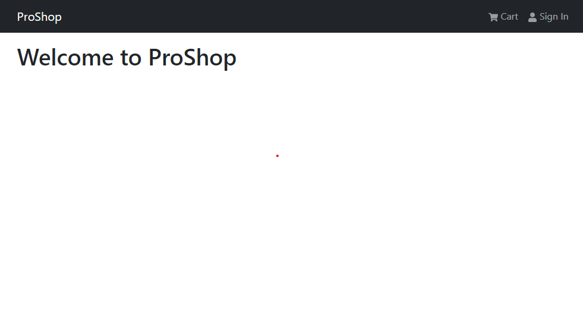

# Header & Footer

Now we are going to create the header and footer components.

### React Bootstrap & React Icons

We are going to use a UI library called **React Bootstrap**. It is a library that provides a set of reusable components that we can use to build our application. Let's install both **React Bootstrap** and the **Bootstrap CSS framework**. We are also going to install a package called **React Icons**, which will let us use Icons from libraries like Font Awesome and use them as components. MAKE SURE that you are in your `frontend` directory.

```bash
cd frontend
npm install react-bootstrap bootstrap react-icons
```

### Import Bootstrap CSS

In the `frontend/src/index.js` file, import the Bootstrap CSS file.

```jsx
import 'bootstrap/dist/css/bootstrap.min.css';
```

### Header Component

Create a folder called `components` inside the `frontend/src` folder. Inside the `components` folder, create a file called `Header.jsx`. This is where we are going to create our header component.

Add the follwing code, which imports the `Navbar`, `Nav` and `Container` components from React Bootstrap as well as a few icons from Font Awesome.

```jsx
import { Navbar, Nav, Container } from 'react-bootstrap';
import { FaShoppingCart, FaUser } from 'react-icons/fa';

const Header = () => {
  return (
    <header>
      <Navbar bg='dark' variant='dark' expand='lg' collapseOnSelect>
        <Container>
          <Navbar.Brand href='/'>ProShop</Navbar.Brand>
          <Navbar.Toggle aria-controls='basic-navbar-nav' />
          <Navbar.Collapse id='basic-navbar-nav'>
            <Nav className='ms-auto'>
              <Nav.Link href='/cart'>
                <FaShoppingCart /> Cart
              </Nav.Link>
              <Nav.Link href='/login'>
                <FaUser /> Sign In
              </Nav.Link>
            </Nav>
          </Navbar.Collapse>
        </Container>
      </Navbar>
    </header>
  );
};

export default Header;
```

We are using the `Navbar` component from React Bootstrap. The `Navbar` component is a wrapper for positioning branding, navigation, and other elements into a concise header. It also provides a responsive collapsed state for horizontal navigation.

### App.js Format

Import the `Header` component at the top of the `App.js`. We are also going to import the `Container` component from React Bootstrap.

We will also add a `main` tag with a class to add some padding to the top of the page. We are also going to add a `Container` component inside the `main` tag that wraps the `h1` tag.

```jsx
import { Container } from 'react-bootstrap';
import Header from './components/Header';

const App = () => {
  return (
    <>
      <Header />
      <main className='py-3'>
        <Container>
          <h1>Welcome to ProShop</h1>
        </Container>
      </main>
    </>
  );
};

export default App;
```

It should look like this:



### Footer Component

Now, let's create the footer component. Inside the `components` folder, create a file called `Footer.jsx`. Add the following code:

```jsx
import { Container, Row, Col } from 'react-bootstrap';

const Footer = () => {
  const currentYear = new Date().getFullYear();

  return (
    <footer>
      <Container>
        <Row>
          <Col className='text-center py-3'>
            <p>ProShop &copy; {currentYear}</p>
          </Col>
        </Row>
      </Container>
    </footer>
  );
};
export default Footer;
```

We are using the `Container`, `Row` and `Col` components from React Bootstrap. The `Container` component is a wrapper for positioning content. The `Row` component is a wrapper for positioning columns. The `Col` component is a wrapper for positioning content inside a column.

We also added a dynamic year to the footer. We are using the `Date` object to get the current year.

Now, bring in the footer and add it to your `App.js` file. The completed `App.js` file should look like this:

```jsx
import { Container } from 'react-bootstrap';
import Header from './components/Header';
import Footer from './components/Footer';

const App = () => {
  return (
    <>
      <Header />
      <main className='py-3'>
        <Container>
          <h1>Welcome to ProShop</h1>
        </Container>
      </main>
      <Footer />
    </>
  );
};

export default App;
```
