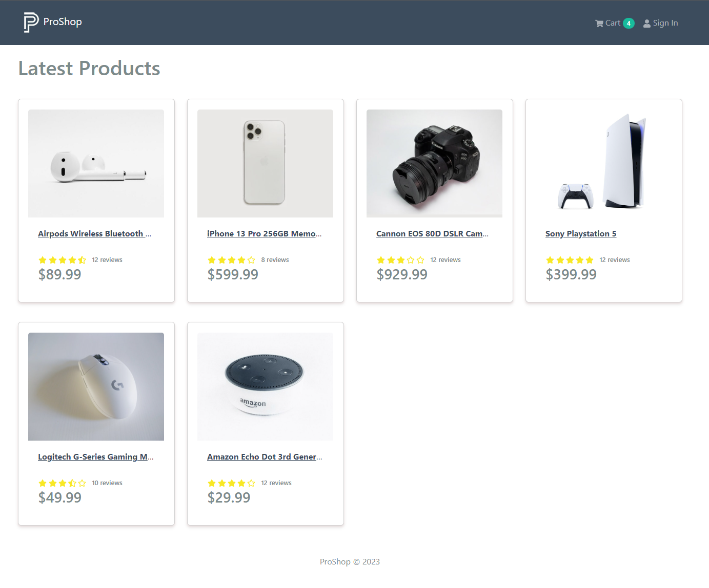

# Custom Bootstrap Theme

This lesson is completely optional. Right now, we are using the default Bootstrap theme. I created a custom version that changes a few things up such as the colors, navbar height, shadows and some other small things to make the site not look as "Bootstrap-y".

All you have to do to use this theme is include the `bootstrap.custom.css` file instead of the default. You'll find that file in the download for this lesson.

You can put it where you want, but I am going to create a folder in the `frontend/src` folder called `assets` and then a folder in there called `styles`. Then I will put the `bootstrap.custom.css` file in there as well as the `index.css` file.

Then in the `index.js` file, I will import both files

```js
// import 'bootstrap/dist/css/bootstrap.min.css';
// import `index.css`
import './assets/styles/bootstrap.custom.css';
import './assets/styles/index.css';
```

## Logo

I also have a simple logo that I will include in the download. You can put that right in the `frontend/src/assets` folder as well and use it in the `Header` component like this:

```js
import logo from '../assets/logo.png';

<Navbar.Brand>
  
  ProShop
</Navbar.Brand>;
```

Now your theme should look a little different. Here is what it looks like:



I will include the custom theme files if you want to customize it further. You will need to edit the Sass files, so you'll need to compile them. I use the VS Code extension "Live Sass Compiler" by Glenn Marks.
