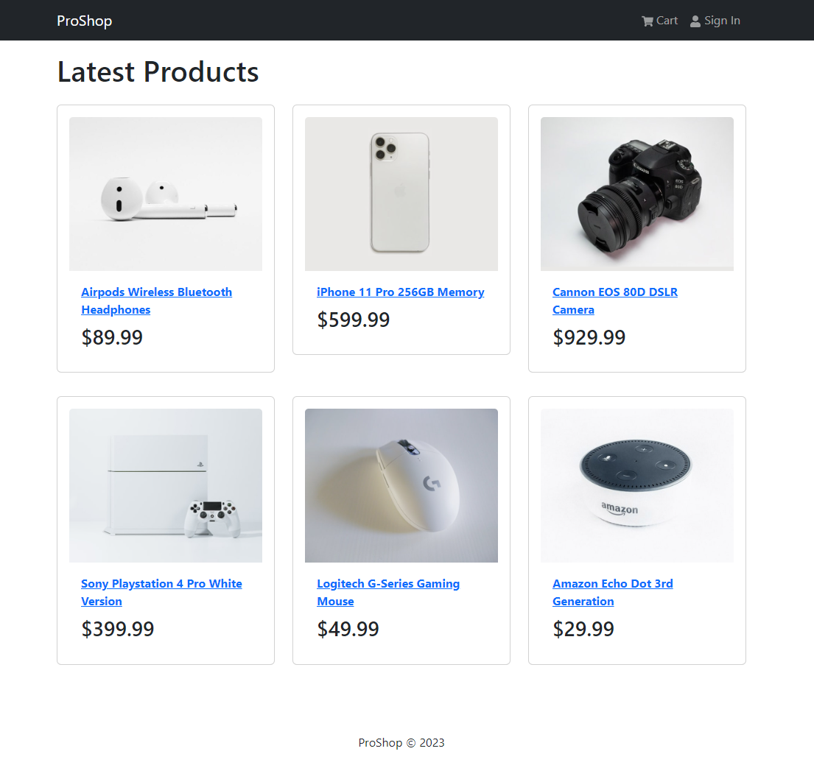

# List Products

Obviously, we do not have a database yet, but we want to get something on the screen. We will use a static array of products for now. We will replace this with a database later. We will also add some images to the `public` folder for each product.

### Images

First, let's add the images for the sample products. Create a folder called `images` in the `public` folder and add the images. You can find them either in the course files for this lesson or from the GitHub Repo.

### Dummy Products

In the course files, you will have a file called `products.js`. This file contains an array of products. Copy this file to the `src` folder. We will use this file to get the products for now.

A product object will look like this with the following fields:

```js
 {
    _id: '1',
    name: 'Airpods Wireless Bluetooth Headphones',
    image: '/images/airpods.jpg',
    description:
      'Bluetooth technology lets you connect it with compatible devices wirelessly High-quality AAC audio offers immersive listening experience Built-in microphone allows you to take calls while working',
    brand: 'Apple',
    category: 'Electronics',
    price: 89.99,
    countInStock: 10,
    rating: 4.5,
    numReviews: 12,
  }
```

## Product Component

We will create a component for each product. Create a new folder called `components` in the `src` folder. Create a new file called `Product.js` in the `components` folder. Add the following code to the file.

```js
import { Card } from 'react-bootstrap';

const Product = ({ product }) => {
  return (
    <Card className='my-3 p-3 rounded'>
      <a href={`/product/${product._id}`}>
        <Card.Img src={product.image} variant='top' />
      </a>

      <Card.Body>
        <a href={`/product/${product._id}`}>
          <Card.Title as='div'>
            <strong>{product.name}</strong>
          </Card.Title>
        </a>

        <Card.Text as='h3'>${product.price}</Card.Text>
      </Card.Body>
    </Card>
  );
};

export default Product;
```

This component is a single card for a product. It takes in the product as a prop. It will be used in the `HomeScreen` and `ProductScreen` components later on.

## HomeScreen Component

Now, we need to create a component to display the products. Create a new file called `HomeScreen.js` in the `screens` folder. Add the following code to the file.

```js
import { Row, Col } from 'react-bootstrap';
import Product from '../components/Product';
import products from '../products';

const HomeScreen = () => {
  return (
    <>
      <h1>Latest Products</h1>
      <Row>
        {products.map((product) => (
          <Col key={product._id} sm={12} md={6} lg={4} xl={3}>
            <Product product={product} />
          </Col>
        ))}
      </Row>
    </>
  );
};

export default HomeScreen;
```

We are bringing in the products data file and looping through it to display the products. We are also using the `Product` component to display each product.

Now, let's add the `HomeScreen` component to the `App.js` file. Add the two new lines of code below.

```js
import { Container } from 'react-bootstrap';
import Header from './components/Header';
import Footer from './components/Footer';
import HomeScreen from './screens/HomeScreen'; // new

const App = () => {
  return (
    <>
      <Header />
      <main className='py-3'>
        <Container>
          <HomeScreen /> {/* new */}
        </Container>
      </main>
      <Footer />
    </>
  );
};

export default App;
```

Your page should look like this now.



In the next lesson, we will implement the React Router so that we can navigate between pages.
