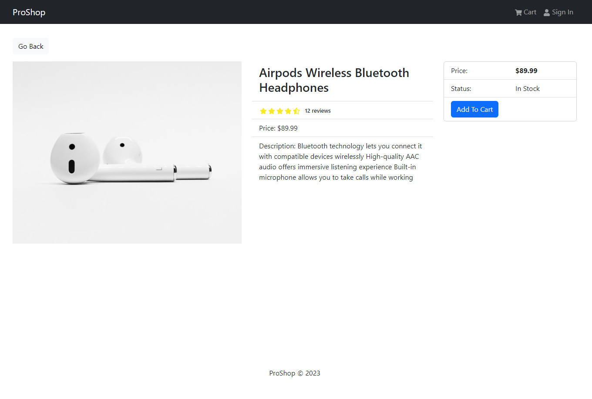

# Product Details Screen

The Product Details Screen is the screen that is displayed when a user clicks on a product in the Product List Screen. It displays the product's details, including the product's name, description, price, and image. It also allows the user to add the product to their cart.

Create a new component in the `src/screens` folder called `ProductScreen.js`.

We need to fetch the product with the correct ID, which is in the URL. We can do this by using the `useParams` hook from `react-router-dom`. This hook will give us access to the `id` in the URL. Let's do that before anything else.

```js
import { useParams } from 'react-router-dom';
import products from '../products';

const ProductScreen = () => {
  const { id: productId } = useParams();
  const product = products.find((p) => p._id === productId);
  console.log(product);

  return <div>ProductScreen</div>;
};

export default ProductScreen;
```

Now let's add a route in the `index.js` file for the `ProductScreen` component.

```js
const router = createBrowserRouter(
  createRoutesFromElements(
    <Route path='/' element={<App />}>
      <Route index={true} path='/' element={<HomeScreen />} />
      <Route path='/product/:id' element={<ProductScreen />} />
    </Route>
  )
);
```

Now if you go to the details page, by clicking on a product, you should see the product info in the console. Now we have to display the product info on the screen.

Your `ProductScreen` component should look like this:

```js
import { useParams } from 'react-router-dom';
import { Link } from 'react-router-dom';
import { Row, Col, Image, ListGroup, Card, Button } from 'react-bootstrap';
import Rating from '../components/Rating';
import products from '../products';

const ProductScreen = () => {
  const { id: productId } = useParams();
  const product = products.find((p) => p._id === productId);

  return (
    <>
      <Link to='/' className='btn btn-light my-3'>
        Go Back
      </Link>
      <Row>
        <Col md={5}>
          <Image src={product.image} alt={product.name} fluid />
        </Col>
        <Col md={4}>
          <ListGroup variant='flush'>
            <ListGroup.Item>
              <h3>{product.name}</h3>
            </ListGroup.Item>
            <ListGroup.Item>
              <Rating
                value={product.rating}
                text={`${product.numReviews} reviews`}
              />
            </ListGroup.Item>
            <ListGroup.Item>Price: ${product.price}</ListGroup.Item>
            <ListGroup.Item>Description: {product.description}</ListGroup.Item>
          </ListGroup>
        </Col>
        <Col md={3}>
          <Card>
            <ListGroup variant='flush'>
              <ListGroup.Item>
                <Row>
                  <Col>Price:</Col>
                  <Col>
                    <strong>${product.price}</strong>
                  </Col>
                </Row>
              </ListGroup.Item>

              <ListGroup.Item>
                <Row>
                  <Col>Status:</Col>
                  <Col>
                    {product.countInStock > 0 ? 'In Stock' : 'Out Of Stock'}
                  </Col>
                </Row>
              </ListGroup.Item>

              <ListGroup.Item>
                <Button
                  className='btn-block'
                  type='button'
                  disabled={product.countInStock === 0}
                >
                  Add To Cart
                </Button>
              </ListGroup.Item>
            </ListGroup>
          </Card>
        </Col>
      </Row>
    </>
  );
};

export default ProductScreen;
```

There is quite a bit going on here, so let's break it down.

We are bringing in a bunch of components from `react-bootstrap` and `react-router-dom`. We are also bringing in the `Rating` component that we created earlier.

We are also bringing in the `products` array from the `products.js` file.

We are using the `useParams` hook to get the `id` from the URL. We are also using the `find` method on the `products` array to get the product with the correct `id`.

We are using the `Link` component from `react-router-dom` to create a link to the home page. We are also using the `Row` and `Col` components from `react-bootstrap` to create a responsive grid. We are also using the `Image` component from `react-bootstrap` to display the product image. We are also using the `ListGroup` component from `react-bootstrap` to display the product details. We are also using the `Card` component from `react-bootstrap` to display the product price and add to cart button.

The add to cart button is disabled if the product is out of stock.

Your page should look like this:



That's it for the Product Details Screen
