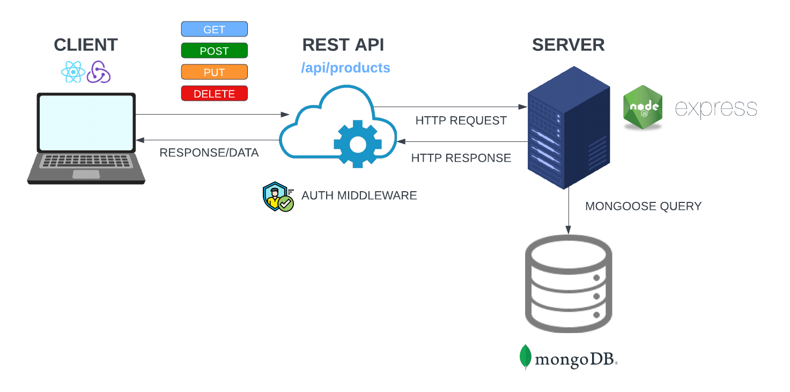

# Full Stack Workflow Explanation

Before we start our backend, I just want to go over how this is all going to work. When you build an application like this, there are a lot of different parts, so I want to make sure that the overall goal is clear to you.

We have started our frontend in a folder called frontend. That is where anything that has to do with our user-facing application will live. We are using React to build our frontend, but it could be any other framework or even just plain HTML, CSS, and JavaScript.

Our backend will live in a separate folder called `backend`. We are using Express to build our backend, but it could be any other framework or even any other language that is capable of creating a REST API.

We will be using MongoDB to store our data, but it could be any other database.

## Routes

We will be using a REST API to communicate between our frontend and our backend. This means that we will have routes or endpoints that are responsible for handling requests to our backend. These routes will be responsible for creating, reading, updating, and deleting data in our database. For instance, we will have a route that is responsibe for getting products. This route will be `/api/products` and we will send a `GET` request to that route from our frontend.

Once we hit that route, we'll need to interact with our database. Our backend will communicate with our MongoDB database with a tool called Mongoose. Mongoose is an `ODM` or `Object Data Mapper'. Once we get the products, we will then send the products back to the frontend in the form of JSON. We will connect to the database with Mongoose. We will also create our data schema and models with it.

Then in React, we can use the products to display them on the screen. We will also use Redux to handle our state.

## Authentication

We will also be using a REST API to handle authentication. We will have a route / endpoint that is responsibe for creating a user. This route will be `/api/users` and we will send a `POST` request to that route from our frontend. We will store the user data in the database with a password hash. We will also generate a token that will be stored in local storage on the frontend. This token will be used to authenticate the user so that we can access private routes. So that is another thing that we have to think about is how to make certain routes private, meaning you must be autheticated to access them.

## Production

When we are ready to deploy our application, we will build our frontend and our backend separately. We will build our frontend with `npm run build` and that will create a build folder. We will then copy the build folder into our backend folder as the Express static/public folder. We will then deploy to render.com. We will also have to set up our environment variables on render.com because we will be using environment variables to store our database connection string and our JWT secret.

I know that this may sound very confusing right now, but I promise that it will all make sense as we go along.
