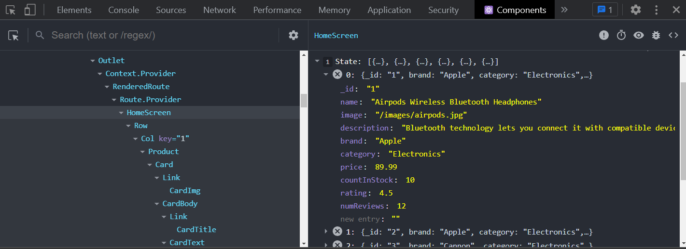

# Fetch Products

Now that we have a server setup that is serving products, we're going to fetch them from our frontend. Obviously, these products will come from a database later on, but we're taking it one step at a time.

You should have both your frontend and backend servers running. If you don't, you can start them by running `npm run dev` in the root of your project.

## Install Axios

We are going to be using Axios for fetching data from our backend. Axios is a promise-based HTTP client that works both in the browser and in Node.js. It makes it easy to make HTTP requests to fetch or save data. If you would rather use the Fetch API, you can do that as well.

To install Axios, run the following command in your terminal from the FRONTEND folder:

```bash
cd frontend
npm install axios
```

## Setup a Proxy

When we make our requests to the backend, we want to make them to `localhost:5000`. Since our dev server is running on `localhost:3000`, we need to setup a proxy so that our requests are forwarded to the correct port. We can do this easily by adding a `proxy` key to our frontend `package.json` file:

Again, make sure that you are in the FRONTEND folder. Open the `package.json` file and add the following:

```json
"proxy": "http://localhost:5000"
```

Be sure to restart your dev server after making this change.

Now we should be able to make requests to our backend server from our frontend server.

## Fetch Products

For now, we will just fetch all of our products right from the `HomeScreen` component. Later on, we will implement a Redux store to manage our state.

Open the `HomeScreen.js` file and remove the products file import. We no longer need this as we will be fetching the products from the backend. Don't delete the file yet, because we are still using it in the details screen.

Import Axios as well as the `useState` and `useEffect` hook:

```js
import React, { useState, useEffect } from 'react';
import axios from 'axios';
```

### Create a State Variable

Let's create a piece of state within our component to hold our products. Put this code right above the `return` statement:

```js
const [products, setProducts] = useState([]);
```

`products` will be an array of products. We will initialize it as an empty array. `setProducts` will be a function that we can use to update the `products` array.

### Fetch Products

Now that we have a state variable to hold our products, we need to fetch them from our backend. We can do this in the `useEffect` hook:

```js
useEffect(() => {
  const fetchProducts = async () => {
    const { data } = await axios.get('/api/products');
    setProducts(data);
  };

  fetchProducts();
}, []);
```

We are now fetching the products and putting them into the component state.

The products showing are now coming from the backend. You can test by changing something in the `backend/data/products.js` file and refreshing the page. You should see the changes.

You can also open up the React Devtools and click on the `HomeScreen` component and you should see the products in the state:



## Fetch Single Product

Now that we are fetching all of our products, we need to fetch a single product for the product details screen. We will do this in the `ProductScreen` component.

Open the `ProductScreen.js` file and remove the product import from the `ProductScreen.js` file. You can also delete the `frontend/src/products.js` file. We no longer need this.

Remove the line where we find the product by id:

```js
const product = products.find((p) => p._id === match.params.id); // Remove this line
```

Import Axios as well as the `useState` and `useEffect` hook:

```js
import React, { useState, useEffect } from 'react';
import axios from 'axios';
```

Create a state variable to hold the product:

```js
const [product, setProduct] = useState({});
```

Fetch the product:

```js
useEffect(() => {
  const fetchProduct = async () => {
    const { data } = await axios.get(`/api/products/${productId}`);
    setProduct(data);
  };

  fetchProduct();
}, [productId]);
```

Here, we are fetching the product by id. We are using the `productId` variable that we get from the URL. We have to add `productId` to the dependency array of the `useEffect` hook so that it will fetch the product when the URL changes.

Now, both the `HomeScreen` and `ProductScreen` components are fetching products from the backend.
