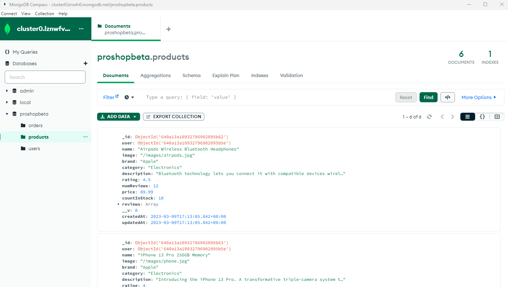

# Seeding Sample Data

Now that we have some sample data, we need to import it into the database. We will do this using a script that we will run from the command line.

## Colored Console Output

We will use the `colors` package to add some color to the console output. From the root directory, install it with the following command:

```bash
npm i colors
```

Create a new file called `seeder.js` inside of the `backend` folder. Add the following code:

```js
import mongoose from 'mongoose';
import dotenv from 'dotenv';
import colors from 'colors';
import users from './data/users.js';
import products from './data/products.js';
import User from './models/userModel.js';
import Product from './models/productModel.js';
import Order from './models/orderModel.js';
import connectDB from './config/db.js';

dotenv.config();

connectDB();
```

We are importing mongoose so that we can make queries to the database, dotenv so that we can access the environment variables, the colors package so that we can add some color to the console output. We are importing the sample data that we created earlier, the models that we created as well as the `connectDB` function that we created earlier. We are then calling the `connectDB` function to connect to the database.

Now I want to have two functions. One to import the data and one to destroy the data. We will use the `async/await` syntax for this. Add the following code:

```js
const importData = async () => {
  try {
    await Order.deleteMany();
    await Product.deleteMany();
    await User.deleteMany();

    const createdUsers = await User.insertMany(users);

    const adminUser = createdUsers[0]._id;

    const sampleProducts = products.map((product) => {
      return { ...product, user: adminUser };
    });

    await Product.insertMany(sampleProducts);

    console.log('Data Imported!'.green.inverse);
    process.exit();
  } catch (error) {
    console.error(`${error}`.red.inverse);
    process.exit(1);
  }
};
```

First, we are clearing out any data that is currently in the database using the `deleteMany` method. Then we are inserting the sample users into the database. We are also getting the id of the first user which is the admin user. We are then mapping over the sample products and adding the admin user as the user for each product. Finally, we are inserting the sample products into the database. We are then logging a success message to the console and exiting the process. We will color it green. If there is an error, it will be in red.

Now, let's create the `destroyData` function. Add the following code:

```js
const destroyData = async () => {
  try {
    await Order.deleteMany();
    await Product.deleteMany();
    await User.deleteMany();

    console.log('Data Destroyed!'.red.inverse);
    process.exit();
  } catch (error) {
    console.error(`${error}`.red.inverse);
    process.exit(1);
  }
};
```

Here we are simply deleting all of the data from the database. We are then logging a success message to the console and exiting the process.

Finally, we need to add the code to run the functions. Add the following code:

```js
if (process.argv[2] === '-d') {
  destroyData();
} else {
  importData();
}
```

When we run the script, we will pass in a command line argument. If the argument is `-d`, we will run the `destroyData` function. Otherwise, we will run the `importData` function.

## NPM Script

We will add a script to the `package.json` file to run the seeder script. Add the following code:

```json
"scripts": {
  "server": "nodemon backend/server",
  "data:import": "node backend/seeder",
  "data:destroy": "node backend/seeder -d"
},
```

## Importing Data

Go ahead and run the following in the root directory:

```bash
npm run data:import
```

You should see the following output:

```bash
Data Imported!
```

Now, go to Compass or MongoDB Atlas and you should see the data in the database. You may need to go to "View->Reload Data" in Compass to see the data.



## Destroying Data

Now, let's destroy the data. Run the following in the root directory:

```bash
npm run data:destroy
```

You should see the following output:

```bash
Data Destroyed!
```

Now, go to Compass or MongoDB Atlas and you should see that the data has been removed from the database.

I do want to have the data there, so let's run the import one more time:

```bash
npm run data:import
```
