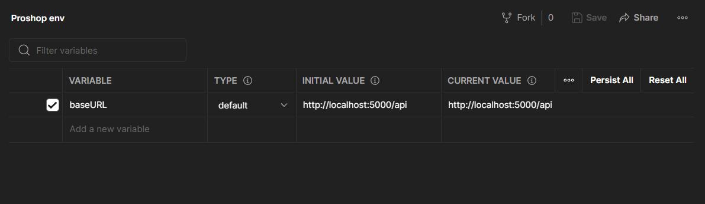
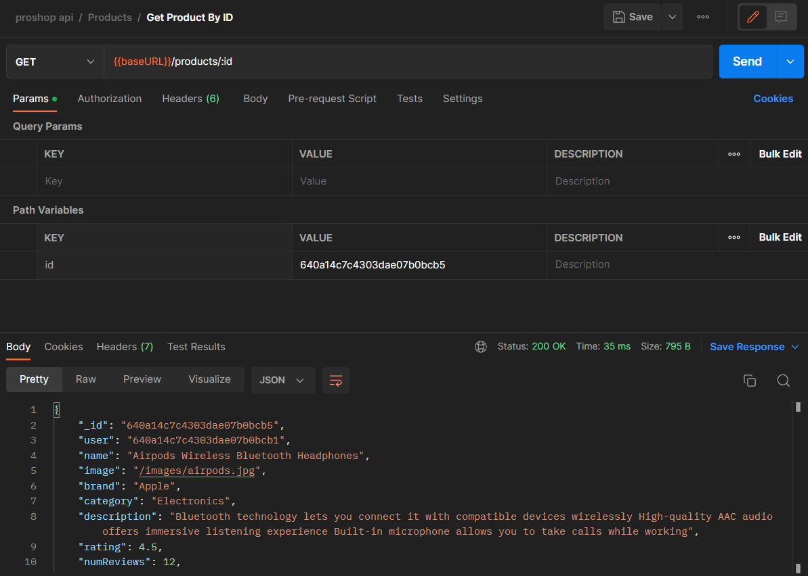

# Getting Started with Postman

Postman is a tool that we can use to make any type of HTTP request that we want. We can use it to test our API endpoints and send data, read responses, and more. It is a very powerful tool that we will use throughout this course.

You can download Postman from [here](https://www.postman.com/downloads/).

Just install it like you would any other program.

Making requests with Postman is easy, you can just open a tab and select the method and enter the URL. You can try it now by making a GET request to `http://localhost:5000/api/products`. You should see the products.

You can do this throughout the course, but I would suggest setting up an environment and collections to keep things organized.

## Postman Environment

We can set up an environment in Postman to make it easier to make requests. We can set up variables that we can use in our requests. We can also set up a base URL and other variables.

To set up an environment, click on `Environments` in the left sidebar and create a new environment called 'proshop env` or whatever you want to call it.

We are going to set up a variable called `baseURL` and set it to `http://localhost:5000/api`. That way, we don't have to change it everywhere if and when we change it. We simply change the value here. Make sure that you click `Save` after you set the value.

In the top right, click on the dropdown and select the environment you just created.

## Create an API

On the left sidebar, select `APIs` and click on `Create New API`. Give it a name and a version. I called mine `proshop api`.

You can add a description if you want. You could also connect a Git repo. I will not be doing that.

## Create a Collection

We should set up a collection for each resource in our api, such as products, users and orders. Click the 3 dots next to the API name and click `Create Collection`. Create a collection called `products`

## Create Requests

Now add a request to the products collection. Call it `Get All Products` and set the method to `GET` and the URL to `{{baseURL}}/products`. You should see the products.

Now create another request called `Get Product By ID`. Set the method to `GET` and the URL to `{{baseURL}}/products/:id`.

Now, under the `Params` tab, add a parameter called `id` and set the value to one of the product ids. Click `Send` and you should see the product with that id.

From now on, this is how we will use Postman. We will save the requests to a collection and use them to test our API.
