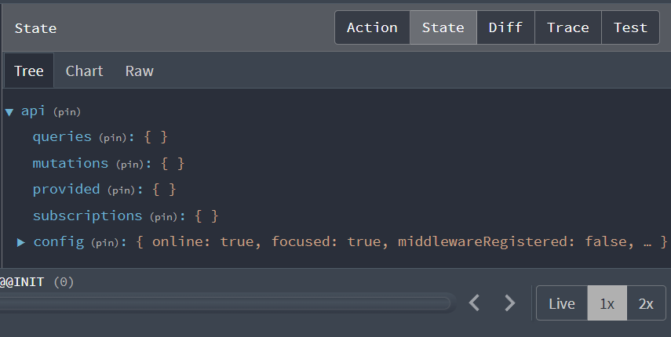

# Create Redux Store & API Slice

Now we are going to move back to the frontend and start to implement Redux. We need to install a few things and create our Redux store, which is where we will keep all of our application state. We will also need to add the Redux store to our application so that it is available to all of our components.

## Install Redux

We are going to use a package called `react-redux`, which is the bridge between redux and react. We are also going to install `Redux Toolkit`.

open your terminal and type the following. Make sure you are in the `frontend` folder.

```bash
cd frontend
npm install react-redux @reduxjs/toolkit
```

## Create a Redux Store

Create a file inside the `frontend/src` directory called `store.js` and add the following:

```js
import { configureStore } from '@reduxjs/toolkit';

const store = configureStore({
  reducer: {},
});

export defawsult store;
```

We are going to use the `configureStore` function to create our store. It will take an object that has a `reducer` property, which will contain all of our reducers.

In simple terms, a reducer is a pure function in Redux that takes the current state and an action as inputs, and returns a new state as output, defining how the state should be updated in response to actions.

For example, if we had a counter application and the user clicked on the increment button, the reducer would take in the current count state and the increment action, and return a new state with the count increased by one. This new state would then be stored in the Redux store and used to update the UI.

## Connect The Store to React

We need to connect our store to our React application. We are going to do this in the `index.js` file.

Open the `frontend/src/index.js` file and add the following:

```js
import { Provider } from 'react-redux';
import store from './store';

ReactDOM.render(
  <Provider store={store}>
    <App />
  </Provider>,
  document.getElementById('root')
);
```

The `Provider` component is a wrapper component that will allow us to access the Redux store from any component in our application. We will also need to import the `store` that we created in the previous step and pass that into the provider.

At this point, you will probably see an error in the console that says that there is no reducer. This is because we have not created any reducers yet. We will do that in the next video. Our store is created and connected.

## Constants

We are going to create our `constants.js` file. This will be a file that holds constants, which are variables that will not change (most likely). It will hold things like endpoints. That way if for some reason, we do change our api endpoints, we only need to update the constants and not go through every instance in the code.

Create a file `frontend/src/constants.js` and add the following:

```js
export const BASE_URL =
  process.env.NODE_ENV === 'develeopment' ? 'http://localhost:5000' : '';
export const PRODUCTS_URL = '/api/products';
```

Our base url will depend on the environment. If we are in development, we will use `http://localhost:5000`. If we are in production, we just have an empty string, because we will be using the same domain. We will also create a constant for the products url.

## API Slice

Redux Toolkit uses a concept called "slices" to organize our state. A slice is a collection of reducers and actions that are related to each other. We can create multiple slices in our application, and each slice can have its own state.

We are going to create a slice to deal with our backend API requests. You can think of this as a parent slice to the rest of them, which will be product, user and order slices.

Create a folder called `slices` and a file inside called `apiSlice.js`and add the following imports:

```js
import { fetchBaseQuery, createApi } from '@reduxjs/toolkit/query/react';
import { BASE_URL } from '../constants';
```

We are going to use the `createApi` function to create our API slice. There is another function called `createSlice` that we can use to create a slice, which is a group of reducers and actions, but we are going to use `createApi` because it is designed to work with Redux Toolkit's `createAsyncThunk` function, which we will use to make asynchronous requests to our backend API. We will use `createSlice` later on for things like the shopping cart, where we don't need to write asynchronous requests.

We will also need to import the `fetchBaseQuery` function, which is a function that will allow us to make requests to our backend API. We will also import our `BASE_URL` constant.

Let's define our `basequery` using `fetchBaseQuery`

```js
const baseQuery = fetchBaseQuery({ baseUrl: BASE_URL });
```

Now, create our API slice

```js
export const apiSlice = createApi({
  baseQuery,
  tagTypes: ['Product', 'Order', 'User'],
  endpoints: (builder) => ({}),
});
```

We are going to use the `tagTypes` option to define the types of data that we will be fetching from our backend API. We will also define an empty `endpoints` object for now. We will have separate endpoints in other files for each type of data that we will be fetching. `builder` is a function that will allow us to make requests to our backend API.

## Add the API Slice to the Store

Now, we need to add the reducers and middleware from the `apiSlice` to our store. Open the `store.js` file and add the following code:

```js
import { configureStore } from '@reduxjs/toolkit';
import { apiSlice } from './slices/apiSlice';

export const store = configureStore({
  reducer: {
    [apiSlice.reducerPath]: apiSlice.reducer,
  },
  middleware: (getDefaultMiddleware) =>
    getDefaultMiddleware().concat(apiSlice.middleware),
  devTools: true,
});
```

We are going to add the `apiSlice` reducer to our store. So any reducers that we create for the `apiSlice` will be added to our store. Reducers are pure functions that take the current state and an action as inputs, and return a new state as output, defining how the state should be updated in response to actions.

We will also add the `apiSlice` middleware to our store as well as the `devTools` property, which will allow us to use the Redux DevTools extension.

Now that error in the console should be gone. Also, if you open the Redux DevTools extension and click on `state`, you should see something like this:



This shows us any queries and mutations that have run. We don't have any yet, so it is empty, but in the next lesson, we will create our product slice to make a query to get products from our store.
