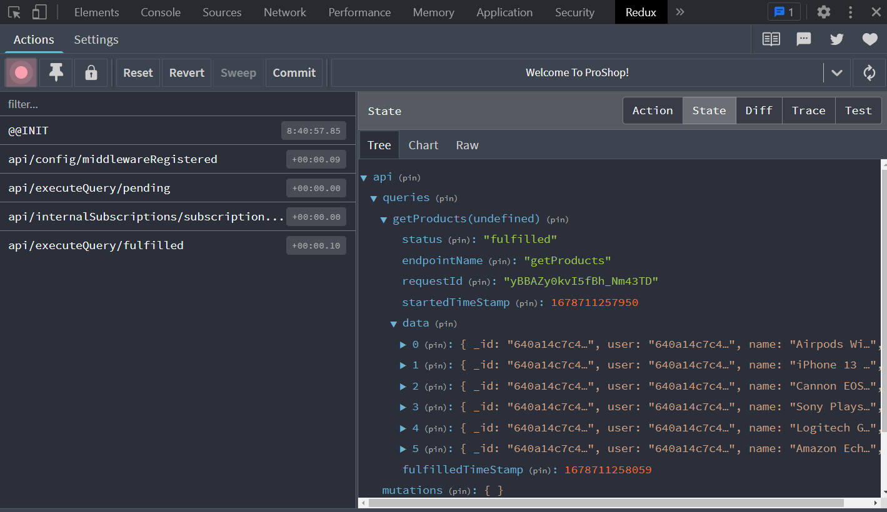

# Products API Slice & Get All Products

Now that we have a store up and running with a parent API slice, we are now ready to create our products API slice to get and display products on the HomeScreen and the ProductScreen.

Create a file in `frontend/src/slices` called `productsApiSlice.js` and add the following:

```js
import { PRODUCTS_URL } from '../constants';
import { apiSlice } from './apiSlice';

export const productsApiSlice = apiSlice.injectEndpoints({
  endpoints: (builder) => ({
    getProducts: builder.query({
      query: () => ({
        url: PRODUCTS_URL,
      }),
      keepUnusedDataFor: 5,
    }),
  }),
});
```

We are going to use the `injectEndpoints` function to add our endpoints to the `apiSlice`. We are going to add a `getProducts` endpoint to our `apiSlice`. This endpoint will make a request to our backend API to get all of the products. The `keepUnusedDataFor` option will keep the data in the cache for 5 seconds.

Now, we need to export this from the file:

```js
export const { useGetProductsQuery } = productsApiSlice;
```

You can see the convention that is used here. We add "use" on to the endpoint name and then add "Query" to the end. This is the convention that is used in the `react-query` library. The `@reduxjs/toolkit/query` is actually a wrapper around the `react-query` library `useQuery` hook.

I know this may seem overwhelming, but this is all sort of boilerplate code that we will be able to reuse for other endpoints. Once you get familiar with the overall structure of your application, you will be able to create new endpoints quickly.

## Display Product On HomeScreen

Now, we are going to display the products on the home screen. Open the `HomeScreen.js` file and remove the useEffect and the state entirely. So get rid of the following code:

```js
import { useState, useEffect } from 'react';
import axios from 'axios';

const [products, setProducts] = useState([]);

useEffect(() => {
  const fetchProducts = async () => {
    const { data } = await axios.get('/api/products');
    setProducts(data);
  };

  fetchProducts();
}, []);
```

We want to use our `useGetProductsQuery` hook to get the products. So let's add that in place of the previous code:

Import it:

```js
import { useGetProductsQuery } from '../slices/productsApiSlice';
```

Use it to get our state:

```js
const { data: products, isLoading, error } = useGetProductsQuery();
```

Now let's check for the loading state and any errors within our JSX:

```js
  return (
    <>
      {isLoading ? (
        <div>Loading...</div>
      ) : error ? (
        <div>{error?.data.message || error.error}</div>
      ) : (
        <>
          <h1>Latest Products</h1>
          <Row>
            {products.map((product) => (
              <Col key={product._id} sm={12} md={6} lg={4} xl={3}>
                <Product product={product} />
              </Col>
            ))}
          </Row>
        </>
      )}
    </>
  );
};
```

You should still see your products.

So by following the correct conventions, we are able to get the products as well as the loading state and any possible errors. This is what makes Redux Toolkit so powerful. Without it, we would need to manage all that ourselves.

## Redux Devtools

If you open the Redux Devtools, you will see all of the actions that took place when the page loaded. If we click on the 'fulfilled' action, you will see all of the products in the payload.

If you click on `state`, you will see under `api`, it shows our queries and mutations. If you click on `queries`, you will see the `getProducts` query. If you click on that, you will see the `data` and `status` of the query. If you click on `data`, you will see all of the products.



In the first version of the course, we didn't use Redux Toolkit and we handled all of the loading state and errors manually, which in turn caused quite a few bugs in the code. By using Redux Toolkit, we are able to get all of the loading state and errors for free. Which is great.

In the next lesson, we will do the same for the single product page
