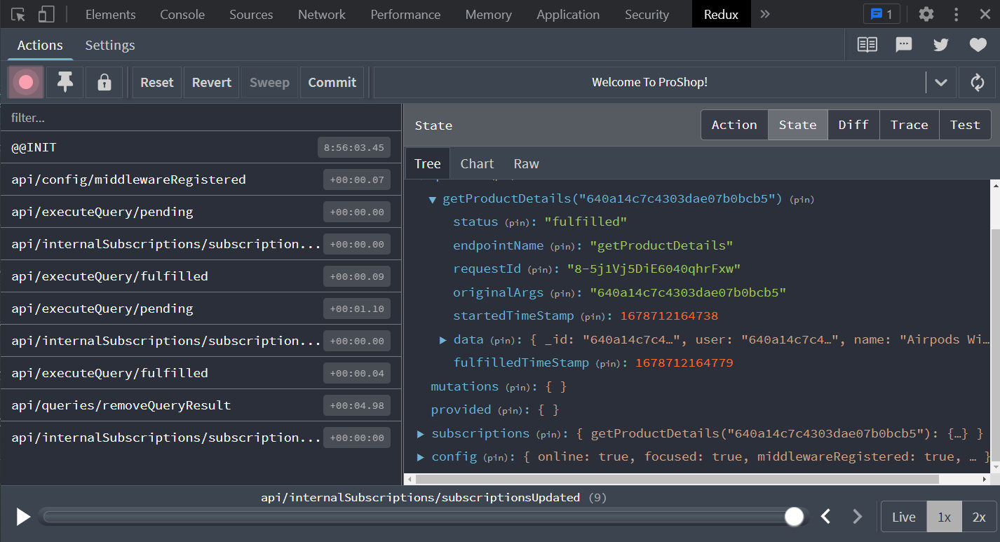

# Query Single Products

On our details page, we need to query a single product. This is going to be very similar to what we did in the last lesson. We need to add an endpoint in the `productsApiSlice.js` file. We also need to add a new `useGetProductDetailsQuery` hook. Then we need to use that hook in the `ProductScreen.js` file.

In the `productsApiSlice.js` file, add the `getProductDetailsQuery` endpoint:

```js
export const productsApiSlice = apiSlice.injectEndpoints({
  endpoints: (builder) => ({
    getProducts: builder.query({
      query: () => ({
        url: PRODUCTS_URL,
      }),
      keepUnusedDataFor: 5,
    }),
    // Add this endpoint
    getProductDetails: builder.query({
      query: (productId) => ({
        url: `${PRODUCTS_URL}/${productId}`,
      }),
      keepUnusedDataFor: 5,
    }),
  }),
});
```

Then export it:

```js
export const { useGetProductsQuery, useGetProductDetailsQuery } =
  productsApiSlice;
```

Open the `frontend/src/screens/ProductScreen.js` file and remove the useEffect and the state entirely. So get rid of the following code:

```js
import { useState, useEffect } from 'react';
import axios from 'axios';

const [product, setProduct] = useState({});

useEffect(() => {
  const fetchProduct = async () => {
    const { data } = await axios.get(`/api/products/${productId}`);
    setProduct(data);
  };

  fetchProduct();
}, [productId]);
```

Replace it with the following code:

```js
import { useGetProductDetailsQuery } from '../slices/productsApiSlice';

const {
  data: product,
  isLoading,
  error,
} = useGetProductDetailsQuery(productId);
```

Hopefully, you can see the pattern of what we are doing when it comes to fetching and loading data through Redux.

Now, edit the output to look like this:

```js
return (
  <>
    <Link className='btn btn-light my-3' to='/'>
      Go Back
    </Link>
    {isLoading ? (
      <div>Loading...</div>
    ) : error ? (
      <div>{error?.data?.message || error.error}</div>
    ) : (
      <>
        <Row>
          <Col md={6}>
            <Image src={product.image} alt={product.name} fluid />
          </Col>
          <Col md={3}>
            <ListGroup variant='flush'>
              <ListGroup.Item>
                <h3>{product.name}</h3>
              </ListGroup.Item>
              <ListGroup.Item>
                <Rating
                  value={product.rating}
                  text={`${product.numReviews} reviews`}
                />
              </ListGroup.Item>
              <ListGroup.Item>Price: ${product.price}</ListGroup.Item>
              <ListGroup.Item>
                Description: {product.description}
              </ListGroup.Item>
            </ListGroup>
          </Col>
          <Col md={3}>
            <Card>
              <ListGroup variant='flush'>
                <ListGroup.Item>
                  <Row>
                    <Col>Price:</Col>
                    <Col>
                      <strong>${product.price}</strong>
                    </Col>
                  </Row>
                </ListGroup.Item>
                <ListGroup.Item>
                  <Row>
                    <Col>Status:</Col>
                    <Col>
                      {product.countInStock > 0 ? 'In Stock' : 'Out Of Stock'}
                    </Col>
                  </Row>
                </ListGroup.Item>
                <ListGroup.Item>
                  <Button
                    className='btn-block'
                    type='button'
                    disabled={product.countInStock === 0}
                  >
                    Add To Cart
                  </Button>
                </ListGroup.Item>
              </ListGroup>
            </Card>
          </Col>
        </Row>
      </>
    )}
  </>
);
```

We first check to see if the content is loading, if it is, we just display some text, but in the next video, we will create a loader with a spinner to put in that spot.

In the the error `div`, we used **optional chaining** with `?`, which will allow us to safely access nested properties of an object without causing an error if one of the intermediate properties is undefined or null.

We also made it so the button will be disabled if there is no stock.

Now you should see the single product page. If you open the devtools, you will see the query and data returned from our store:


