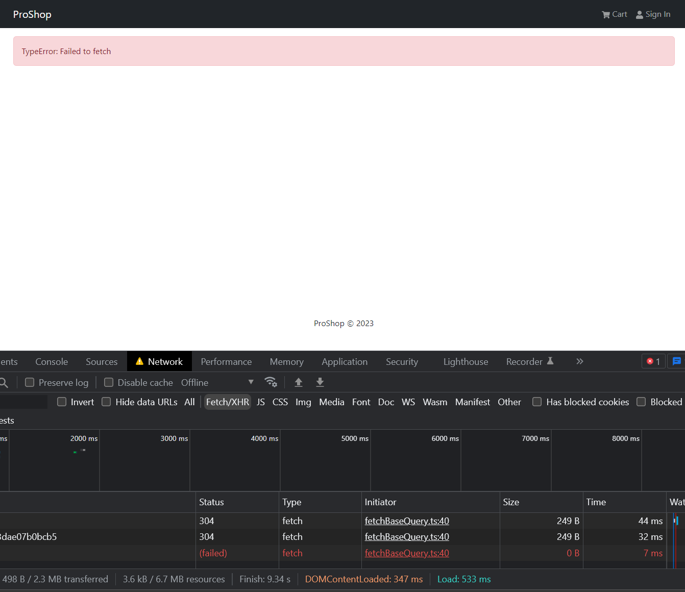

# Loader & Message Components

In this lesson, we will create the loader and message components.

## Loader Component

The Loader component will be a spinner that will show when the app is loading data.

Create a file named `Loader.jsx` in the `components` folder and add the following:

```js
import { Spinner } from 'react-bootstrap';

const Loader = () => {
  return (
    <Spinner
      animation='border'
      role='status'
      style={{
        width: '100px',
        height: '100px',
        margin: 'auto',
        display: 'block',
      }}
    ></Spinner>
  );
};

export default Loader;
```

The code is pretty simple. We are just bringing in and using the `Spinner` component from `react-bootstrap`. We are also setting some styles to center the spinner.

Let's bring it into our HomeScreen component and use it.

```js
import Loader from '../components/Loader';
```

Replace the `<div>Loading...</div>` with `<Loader />`.

```js
{isLoading ? (
  <Loader />
) : error ? (
  <div>{error?.data?.message || error.error}</div>
) : (
  <>
```

Do the same in the `ProductScreen` component.

## Message Component

Create a file named `Message.jsx` in the `components` folder and add the following:

```js
import { Alert } from 'react-bootstrap';

const Message = ({ variant, children }) => {
  return <Alert variant={variant}>{children}</Alert>;
};

Message.defaultProps = {
  variant: 'info',
};

export default Message;
```

Here, we are using the `Alert` component from `react-bootstrap`. We are also setting the default variant to `info`. It can take in a variant as a prop as well.

In both `HomeScreen` and `ProductScreen`, replace

```jsx
<div>{error?.data?.message || error.error}</div>
```

with

```jsx
<Message variant='danger'>{error?.data?.message || error.error}</Message>
```

If you want to test it out, go to one of the product details pages and open your devtools `Network` tab. Select "Offline" from the dropdown and then click the `back` button in the UI. You should see the error message.


