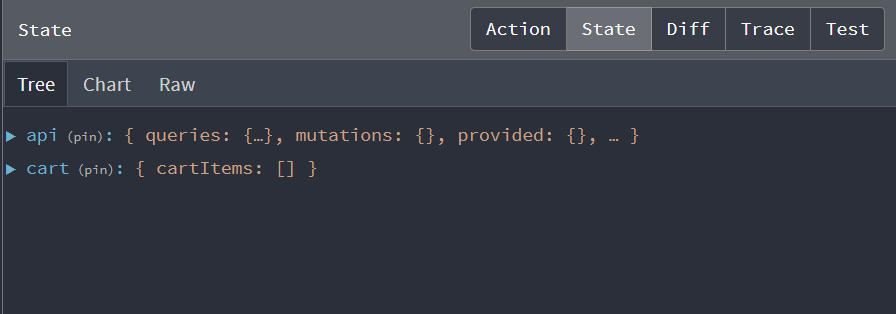

# Cart Slice & Reducer


Now we are going to start to implement the shopping cart. Since we are using Redux Toolkit, we will create a new slice for the cart. Create a file called `cartSlice.js` in the `slices`. Since we are not dealing with any async API operations, we are going to use `createSlice` instead of `createApi`. let's import it:

```js
import { createSlice } from '@reduxjs/toolkit';
```

Now, add the following:

```js
const cartSlice = createSlice({
  name: 'cart',
  initialState,
  reducers: {},
});

export default cartSlice.reducer;
```

## Initial Cart State

`createSlice` takes in a name, the initial state and the reducers. We are exporting the reducers. Let's create an object that contains the initial state. Put this right above the `cartSlice`:

```js
const initialState = localStorage.getItem('cart')
  ? JSON.parse(localStorage.getItem('cart'))
  : { cartItems: [] };
```

This will first check to see if there are any items in the cart in local storage. If there are, it will parse the JSON and set it to the initial state. If there are not, it will set the initial state to an object containing an empty array.

## Add Cart Slice To Store

Open up the `store.js` file and import the cart slice reducer:

```js
import cartSliceReducer from './slices/cartSlice';
```

Then, add it to the `configureStore` function:

```js
const store = configureStore({
    reducer: {
    [apiSlice.reducerPath]: apiSlice.reducer,
    cart: cartSliceReducer
  },
});
```

Now, if you open the Redux DevTools, you should see the cart state.

