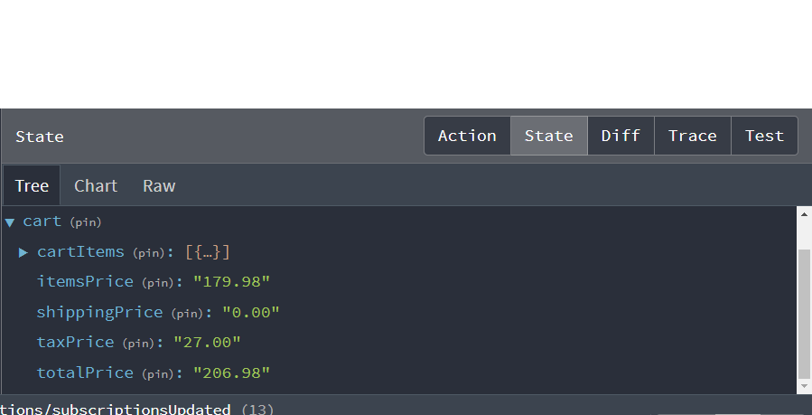
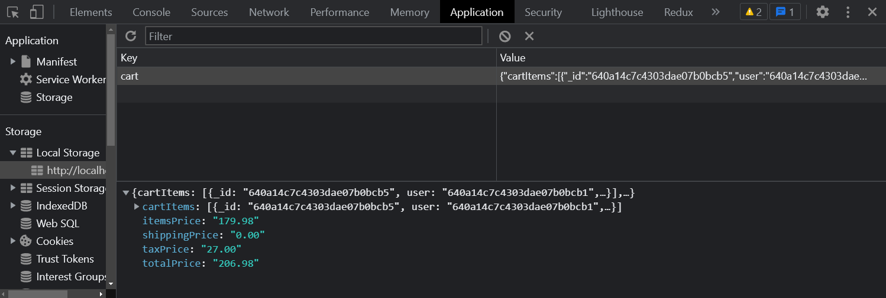

# Implement Add To Cart

Now, we need to use the action creator that we exported from the `cartSlice` to be able to actually add products to the cart. Open up the `ProductScreen.js` file and import the `addToCart` action creator as well as the hooks `useState` from react, `useDispatch` from react-redux and `useNavigate` from react-router-dom:

```js
import { useState } from 'react';
import { useNavigate, useParams } from 'react-router-dom';
import { useDispatch } from 'react-redux';
import { addToCart } from '../slices/cartSlice';
```

We have a bunch of things to do. We need to:

1. Add a piece of state for the quantity,
2. Initialize both `useDispatch` and `useNavigate`
3. Create a handler for adding to the cart
4. Add the quantity select form
5. Add the handler to the button

Add the following to the `ProductScreen` component:

```js
const ProductScreen = () => {
  const { id: productId } = useParams();

  const dispatch = useDispatch(); // <-- add this
  const navigate = useNavigate(); // <-- add this

  const [qty, setQty] = useState(1); // <-- add this

  // add this
  const addToCartHandler = () => {
    dispatch(addToCart({ ...product, qty }));
    navigate('/cart');
  };

  const {
    data: product,
    isLoading,
    error,
  } = useGetProductDetailsQuery(productId);

  // return...
};
```

## Add the quantity select form

Add the following to the returned JSX right above the `<ListGroup.Item>` that surrounds the `<Button>`:

```js
{
  /* Qty Select */
}
{
  product.countInStock > 0 && (
    <ListGroup.Item>
      <Row>
        <Col>Qty</Col>
        <Col>
          <Form.Control
            as='select'
            value={qty}
            onChange={(e) => setQty(Number(e.target.value))}
          >
            {[...Array(product.countInStock).keys()].map((x) => (
              <option key={x + 1} value={x + 1}>
                {x + 1}
              </option>
            ))}
          </Form.Control>
        </Col>
      </Row>
    </ListGroup.Item>
  );
}
```

This will add a form field for the quantity and show the number of items in stock. The `onChange` handler will update the `qty` state. Be sure to cast as a Number.

The `...Array()` is used to create an array of the length of the number of items in stock. The `keys()` method is used to create an array of the indexes of the array. The `map()` method is used to create an array of `<option>` elements. The `key` is the index + 1 and the `value` is the index + 1. The `value` is what will be set to the `qty` state.

## Implement addToCartHandler

Go down to the button in the returned JSX and add the `onClick` handler:

```js
<Button
  className='btn-block'
  type='button'
  disabled={product.countInStock === 0}
  onClick={addToCartHandler} // <-- add this
>
  Add To Cart
</Button>
```

## Test it out

If you select a new qty value, it will change the local `qty` state. You can see this from within the React devtools. If you click the `Add To Cart` button, you should see the `addToCart` action being dispatched in the Redux devtools. You should also be redirected to the `/cart` page. The `cart` page has not been created yet, so pay no attention to that. Just make sure that the items are not in your state.



I Chose the Airpods. I put 2 for the qty, that's why the price is $179.98.

If you look in your local storage in the browser devtools `applicatino` tab, you should see the `cart` key with the value of the cart items



if you click the "clear all" button, it will empty your cart items
