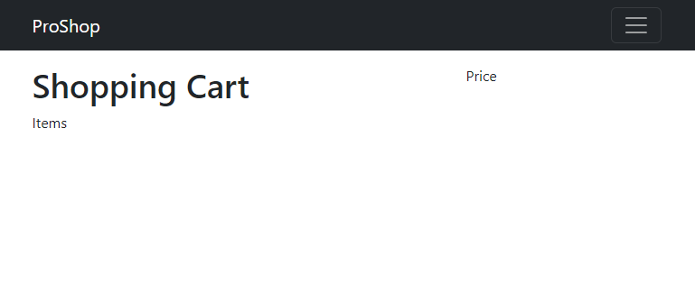
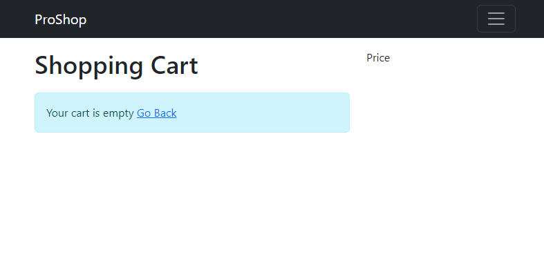
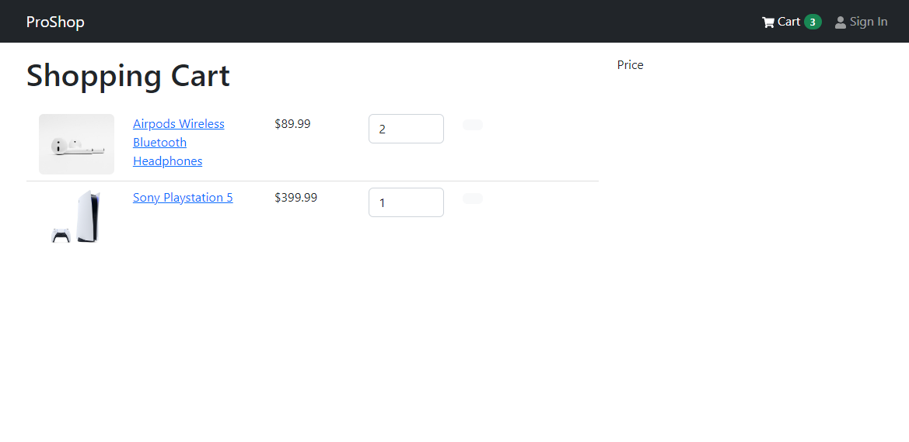
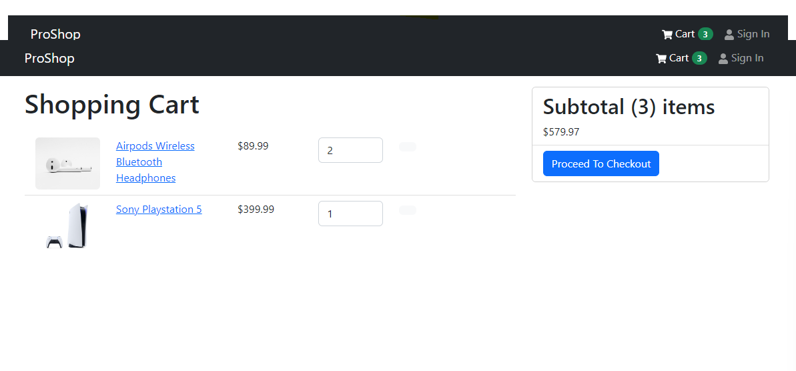

# Cart Screen

In this lesson, we will create the cart screen.

Create a new file in the `screens` folder called `CartScreen.js`.

We need to import a few things. We know we will be getting the cart items/state from the Redux store, so we need to import `useSelector` and `useDispatch` from `react-redux`. We need these two almost every time we want to get something from the Redux store.

We also need to import `Link` and `useNavigate` from `react-router-dom`, `Message` component as well as a few other components from `react-bootstrap`. We also need to import the `FaTrash` icon from `react-icons/fa`.

```js
import { Link, useNavigate } from 'react-router-dom';
import { useDispatch, useSelector } from 'react-redux';
import {
  Row,
  Col,
  ListGroup,
  Image,
  Form,
  Button,
  Card,
} from 'react-bootstrap';
import { FaTrash } from 'react-icons/fa';
import Message from '../components/Message';
```

Let's create the function and initialize the `navigate` and `dispatch` variables.

```js
const CartScreen = () => {
  const navigate = useNavigate();
  const dispatch = useDispatch();

  return <div>CartScreen</div>;
};
export default CartScreen;
```

We will need to get the cart items from our state:

```js
const cart = useSelector((state) => state.cart);
const { cartItems } = cart;
```

## the JSX

Let's start to build the output of our screen. We will have 2 columns. The first column will be the list of items in the cart. The second column will be the summary of the items in the cart.

Add the following code to the return statement:

```jsx
<Row>
  <Col md={8}>
    <h1 style={{ marginBottom: '20px' }}>Shopping Cart</h1>
    {cartItems.length === 0 ? (
      <Message>
        Your cart is empty <Link to='/'>Go Back</Link>
      </Message>
    ) : (
      <ListGroup variant='flush'>Items</ListGroup>
    )}
  </Col>
  <Col md={4}>Price</Col>
</Row>
```

We are creating two columns. In the first, we are checking if the cart is empty. If it is, we are showing a message. If it is not, we are showing the text `Items` for now. The second column is just showing the text `Price`.

## Create The Route

In the `index.js` file, add the route to the cart screen:

```js
import CartScreen from './screens/CartScreen';
```

```jsx
<Route path='/' element={<App />}>
  <Route index={true} path='/' element={<HomeScreen />} />
  <Route path='/product/:id' element={<ProductScreen />} />
  <Route path='/cart' element={<CartScreen />} />
</Route>
```

Now, click on the cart item in the navigation and you should see this:



If you clear the items from local storage, you should see the message:



Let's work on the first column and show the items. Make sure that you add a few items to the cart.

Add the following code to the return statement:

```jsx
<Row>
  <Col md={8}>
    <h1 style={{ marginBottom: '20px' }}>Shopping Cart</h1>
    {cartItems.length === 0 ? (
      <Message>
        Your cart is empty <Link to='/'>Go Back</Link>
      </Message>
    ) : (
      <ListGroup variant='flush'>
        {cartItems.map((item) => (
          <ListGroup.Item key={item._id}>
            <Row>
              <Col md={2}>
                <Image src={item.image} alt={item.name} fluid rounded />
              </Col>
              <Col md={3}>
                <Link to={`/product/${item._id}`}>{item.name}</Link>
              </Col>
              <Col md={2}>${item.price}</Col>
              <Col md={2}>
                <Form.Control as='select' value={item.qty}>
                  {[...Array(item.countInStock).keys()].map((x) => (
                    <option key={x + 1} value={x + 1}>
                      {x + 1}
                    </option>
                  ))}
                </Form.Control>
              </Col>
              <Col md={2}>
                <Button type='button' variant='light'>
                  <FaTrash />
                </Button>
              </Col>
            </Row>
          </ListGroup.Item>
        ))}
      </ListGroup>
    )}
  </Col>
  <Col md={4}>Price</Col>
</Row>
```

You should now see the products that are in the cart:



Now, let's add the code for the second column. Add the following code to the return statement:

```jsx
<Col md={4}>
  <Card>
    <ListGroup variant='flush'>
      <ListGroup.Item>
        <h2>
          Subtotal ({cartItems.reduce((acc, item) => acc + item.qty, 0)}) items
        </h2>
        ${cartItems.reduce((acc, item) => acc + item.qty * item.price, 0).toFixed(2)}
      </ListGroup.Item>
      <ListGroup.Item>
        <Button
          type='button'
          className='btn-block'
          disabled={cartItems.length === 0}
        >
          Proceed To Checkout
        </Button>
      </ListGroup.Item>
    </ListGroup>
  </Card>
</Col>
```

Now, you will see the subtotal and a button to checkout.



The last thing that I want to do is to make it so if we add to the quantity of an item, it will update the quantity in the cart. This is actually pretty simple, since we already have the `addToCart` action. We just need to dispatch it.

Create the following function above the return statement:

```js
const addToCartHandler = async (product, qty) => {
  dispatch(addToCart({ ...product, qty }));
};
```

Now, go down to the `Form.Control` component and add the following code to the `onChange` attribute:

```jsx
<Form.Control
  as='select'
  value={item.qty}
  onChange={(e) => addToCartHandler(item, Number(e.target.value))} // <--- this line
>
  {[...Array(item.countInStock).keys()].map((x) => (
    <option key={x + 1} value={x + 1}>
      {x + 1}
    </option>
  ))}
</Form.Control>
```

We need to bring in the `addToCart` action creator that we exported from the `cartSlice`:

```js
import { addToCart, removeFromCart } from '../slices/cartSlice';
```

Now, if you change the quantity of an item, it will update the quantity in the cart and you should see the price change. The amount in the header will also change. As you can see, we have built this in a very reactive way.

In the next lesson, we want to add the ability to remove an item from the cart.
