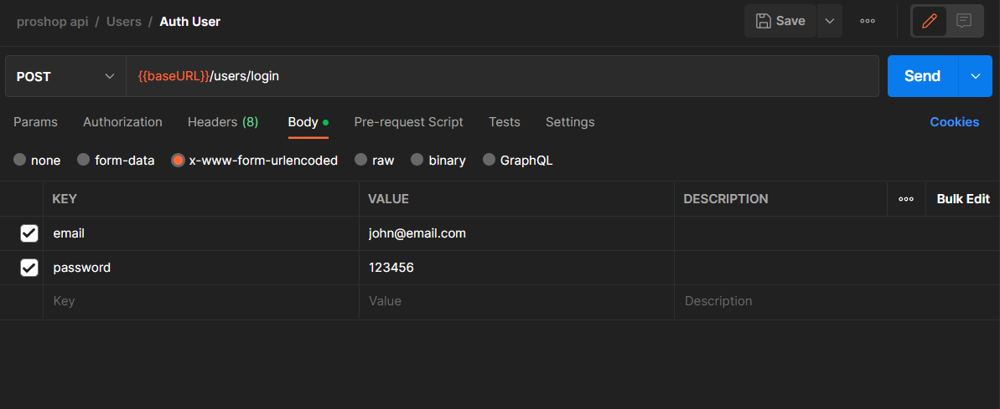

# User Auth Endpoint

We are now going to work on the user auth endpoint. This endpoint will allow the user to authenticate with the API. The user will provide their email and password and the endpoint will ultimately return a JWT token that the user can use to access protected routes.

We are going to do the token functionality in the coming videos. Right now, I just want the user to be able to send their email and password and validate that against what is in the database.

We already have 3 users in the database from the `seeder.js` file. Open up MongoDB Compass or Atlas and make sure that you have those users. If you don't, just run the seeder script from the root folder with the following command:

```bash
npm run data:import
```

This gives us the users:

- admin@email.com (password: 123456)
- john@email.com (password: 123456)
- jane@email.com (password: 123456)

We already encrypted the passwords using bcrypt. So, we can use those to test the auth endpoint.

## `authUser` Function

We already set up a controller function that responds to the endpoint of `/api/users/auth`. Open the file `backend/controllers/userController.js` and look at the `authUser` function. That is the function that we want to focus on right now.

Open Postman and create a new collection called `users`. Create a new request called `Auth User`. Set the method to `POST` and the URL to `{{baseURL}}/users/auth`.

If you send the request right now, you should see the message `auth user`.

## Sending HTTP Body Data

This is the first time that we are sending data from the user on a request. We do this via the HTTP body. The body is where we send data to the server. We can send data in the form of JSON, XML, or other formats.

In Postman, click on the `body` tab. You have a few options on how you can send data. You can choose `raw` and then add a JSON object with your key/values. However, we are going to click on the `x-www-form-urlencoded` option. Then we can simply add the key/values that we want to send.

Add the following key/values:

- email: john@email.com
- password: 123456

It should look like this:



## Accessing the Data On the Server

In Express, we can access the data in the body using the `body` property on the `req` object. In the `authUser` function in the controller, above the `res.send`, add the following code:

```js
console.log(req.body.email, req.body.password);
```

Now, send the request from Postman. You should see an error that says something like `Cannot read properties of undefined (reading email)`. This is because we have not enabled the body parser middleware in Express. We need to do that in order to access the data in the body.

In the `backend/server.js` file, add the following code right under where we defined the `app` variable:

```js
app.use(express.json());
app.use(express.urlencoded({ extended: true }));
```

Now, make the request. You should still only see the `auth user` in Postman, but if you look in the terminal, you should see the email and password that you sent.

##

Now, add the following code to the `authUser` function:

```js
const authUser = asyncHandler(async (req, res) => {
  const { email, password } = req.body;

  const user = await User.findOne({ email });

  if (user) {
    res.json({
      _id: user._id,
      name: user.name,
      email: user.email,
      isAdmin: user.isAdmin,
    });
  } else {
    res.status(401);
    throw new Error('Invalid email or password');
  }
});
```

We destructured the email and password from the body. Then, we used the `findOne` method on the `User` model to find a user with the email that was sent. If we find a user, we send back the user data. If we don't find a user, we send back an error.

Right now, we are not doing anything with the password, so as long as the email that you send matches a user in the database, you will get a successful response. Go ahead and try it with the email and password of one of the users in the database. Then try with one that is not in the database.

## Matching The Password

Now, we need to check the password. We used `bcryptjs` to encrypt the password when we created the user. So, we need to use `bcryptjs` to compare the password that was sent with the encrypted password that is in the database.

There are a few approaches that we can take. We can use the `bcryptjs` method `compare` right here in the controller or we could create a method on the `User` model. I am going to create a method on the `User` model and do it from there. That way we keep that logic in the model.

Open the `backend/models/userModel.js` file and import bcrypt:

```js
import bcrypt from 'bcryptjs';
```

Then add the following code right below the `userSchema` definition:

```js
userSchema.methods.matchPassword = async function (enteredPassword) {
  return await bcrypt.compare(enteredPassword, this.password);
};
```

By adding this method to the `userSchema`, we can now use it on any user that we get from the database. So, we can use it on the `user` that we get from the database in the `authUser` function.

Now go back to the `authUser` function and replace the `if (user)` block with the following code:

```js
if (user && (await user.matchPassword(password))) {
  res.json({
    _id: user._id,
    name: user.name,
    email: user.email,
    isAdmin: user.isAdmin,
  });
} else {
  res.status(401);
  throw new Error('Invalid email or password');
}
```

Now, the password will be checked. If the password is correct, we will send back the user data. If the password is incorrect, we will send back an error. Give it a shot with a password that is NOT correct and then with the one that is (123456).

Now we have a working auth endpoint. In the next lesson, we are going implement JSON Web Tokens. That is the most important part because the user will need that token to access protected routes.
