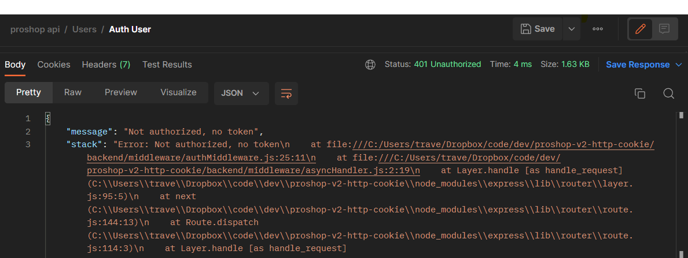
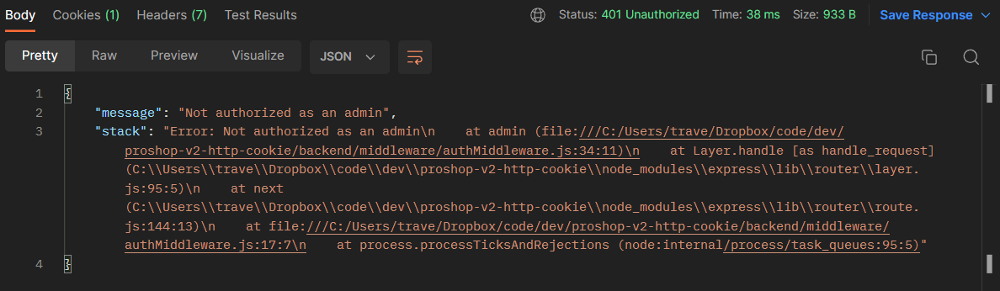

# Auth Middleware

Now that we can authenticate and get an HTTP-Only cookie, we need to write a bit of middleware to check for that jwt cookie and verify it. We will also need to add the user to the request object so that we can access it in other routes.

## Cookie Parser

Before we write our middleware, we need a way to easily parse the cookies from the request object. We can use the `cookie-parser` package for this. Go ahead and install it:

```bash
npm install cookie-parser
```

Now import it at the top of the `server.js` file:

```js
import cookieParser from 'cookie-parser';
```

And add it to the middleware:

```js
app.use(cookieParser());
```

This allows us to get the cookies from the request object. For example, if we had a cookie called `jwt`, we could get it like this:

```js
const jwt = req.cookies.jwt;
```

## Auth Middleware

Create a file called `authMiddleware.js` in the `middleware` folder.

import jwt, our asyncHandler and our User model:

```js
import jwt from 'jsonwebtoken';
import asyncHandler from './asyncHandler.js';
import User from '../models/userModel.js';
```

We are going to have a middleware function called `protect` that will deny access to any route we attache it to unless the user validates with the jwt token with their user ID. It will check for the jwt token cookie, decode it, and add the user to the request object. Then within the route, we can access the user with `req.user`.

```js
const protect = asyncHandler(async (req, res, next) => {
  let token;

  // Read JWT from the 'jwt' cookie
  token = req.cookies.jwt;

  if (token) {
    try {
      const decoded = jwt.verify(token, process.env.JWT_SECRET);

      req.user = await User.findById(decoded.userId).select('-password');

      next();
    } catch (error) {
      console.error(error);
      res.status(401);
      throw new Error('Not authorized, token failed');
    }
  } else {
    res.status(401);
    throw new Error('Not authorized, no token');
  }
});
```

We were able to use `req.cookies.jwt` because we imported the `cookie-parser` package. We are also using the `asyncHandler` to catch any errors.

`jwt.verify` will decode the token and return the payload. We are then using the `userId` from the payload to find the user in the database. We are also using `select('-password')` to exclude the password from the user object. We are then adding the user to the request object so that we can access it in other routes. Finally, we call `next()` to move on to the next middleware.

## Admin Middleware

While we are here, let's create a simple piece of middleware that will check if the user is an admin. We will call this `admin`:

```js
const admin = (req, res, next) => {
  if (req.user && req.user.isAdmin) {
    next();
  } else {
    res.status(401);
    throw new Error('Not authorized as an admin');
  }
};
```

Now, export both of these middleware functions:

```js
export { protect, admin };
```

## Import Middleware

We will be using this middleware in our route files. So, let's import it in the `userRoutes.js` file:

```js
import { protect, admin } from '../middleware/authMiddleware.js';
```

We need to protect all user routes except for `auth` and `register`. Also, only admins should be able to get, update and delete users. So, your file should look like this:

```js
import express from 'express';
import {
  authUser,
  registerUser,
  logoutUser,
  getUserProfile,
  updateUserProfile,
  getUsers,
  deleteUser,
  getUserById,
  updateUser,
} from '../controllers/userController.js';
import { protect, admin } from '../middleware/authMiddleware.js';

const router = express.Router();

router.route('/').post(registerUser).get(protect, admin, getUsers);
router.post('/auth', authUser);
router.post('/logout', logoutUser);
router
  .route('/profile')
  .get(protect, getUserProfile)
  .put(protect, updateUserProfile);
router
  .route('/:id')
  .delete(protect, admin, deleteUser)
  .get(protect, admin, getUserById)
  .put(protect, admin, updateUser);

export default router;
```

Now, let's go to postman and make a GET request to the `/api/users/profile` route. We will create a new request in the users collection called `Get user profile`.

If you have been following along and you logged in and got the JWT cookie set, then it should work and you should see the text `user profile`. If you don't have the cookie set, then you should get a 401 error.

If you want to try and access it without the cookie, then go to the `Cookies` tab in the top right and delete the `jwt` cookie. Then try the request again. You should get a 401 error.



To set the cookie again, you just need to re-authenticate by making a POST request to the `/api/users/auth` route.

## Test Admin Middleware

If you are logged in as the user `john@email.com`, try and make a GET request to the `api/users` route. You should get a 401 error.



Now, clear the cookie and log in as the admin user (admin@email.com). You should just see the text `get users`.

Now we have a way to protect our routes and only allow users with the correct permissions to access them. On top of that, we are doing things in a more secure way by using HTTP-Only cookies and not sending the JWT in the request body.
