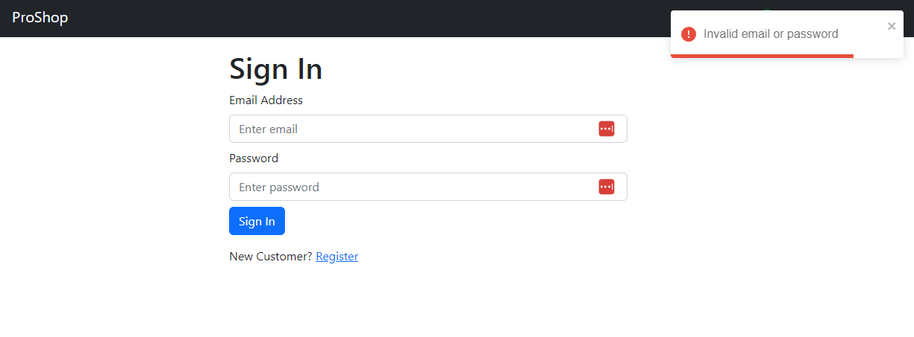

# Login Screen Functionality

Now that we have our login endpoint in the `usersApiSlice` set up and we have the login screen, we can now make the login screen function.

First, let's bring in all the stuff we need:

```js
import { useState, useEffect } from 'react';
import { Link, useLocation, useNavigate } from 'react-router-dom';
import { Form, Button, Row, Col } from 'react-bootstrap';
import { useDispatch, useSelector } from 'react-redux';
import Loader from '../components/Loader';
import FormContainer from '../components/FormContainer';

import { useLoginMutation } from '../slices/usersApiSlice';
import { setCredentials } from '../slices/authSlice';
import { toast } from 'react-toastify';
```

Just to go through this real quick, we are bringing in `useEffect` to check to see if we are authenticated and if we are, we will redirect. `useNavigate` will let us redirect.

We need to know where to redirect to, depending on the URL, so we are bringing in `useLocation`.

`useDispatch` will let us dispatch actions to the store. `useSelector` will let us get data from the store.

We need our `Loader` component to show a loading spinner while we are logging in.

`useLoginMutation` is a hook that was generated by `createApi` for us. It will let us dispatch the `login` action to the store.

`setCredentials` is an action creator that will let us set the credentials in the store.

## React Toastify

`toast` from `react-toastify` is a library that will let us show toast notifications. Right now we do not have that installed, so let's do that now. Make sure you install it in your frontend.

```bash
cd frontend
npm install react-toastify
```

We do need to add a little bit of code to initialize the toast notifications. Let's add that to `App.js`:

```jsx
import { ToastContainer } from 'react-toastify';
import 'react-toastify/dist/ReactToastify.css';
```

Then you can ad the `<ToastContainer />` component right above the `<Header />` component.

```jsx
// ...
<ToastContainer />
<Header />
// ...
```

Let's move on in the `LoginScreen.js` file.

Add the next block of code right above the `submitHandler`:

```js
const dispatch = useDispatch();
const navigate = useNavigate();

const [login, { isLoading }] = useLoginMutation();

const { userInfo } = useSelector((state) => state.auth);

const { search } = useLocation();
const sp = new URLSearchParams(search);
const redirect = sp.get('redirect') || '/';

useEffect(() => {
  if (userInfo) {
    navigate(redirect);
  }
}, [navigate, redirect, userInfo]);
```

We are initializing the `dispatch` and `navigate` variables. We are also initializing the `login` variable, which is the `useLoginMutation` hook. We are also initializing the `isLoading` variable, which is a boolean that will be true if the `login` action is loading.

We are also getting the `userInfo` from the store (auth reducer). We are also getting the `search` value from the `useLocation` hook. We are also initializing the `sp` variable, which is a `URLSearchParams` object.


The `search` property from useLocation() returns the query string of the current URL, which is then passed as an argument to the `URLSearchParams` constructor to create a new URLSearchParams object called sp.

We are also initializing the `redirect` variable, which is the `redirect` query parameter from the URL. If there is no `redirect` query parameter, we will redirect to `/`.

We need to know this because if we are in the checkout process and we login, after we login, we want to redirect to the correct checkout screen. We are getting the `redirect` query parameter from the URL. If there is no `redirect` query parameter, we will redirect to `/`.

We are also using the `useEffect` hook to check to see if we are authenticated. If we are, we will redirect to the `redirect` URL.

Now let's add the `submitHandler` function:

```js
const submitHandler = async (e) => {
  e.preventDefault();
  try {
    const res = await login({ email, password }).unwrap();
    dispatch(setCredentials({ ...res }));
    navigate(redirect);
  } catch (err) {
    toast.error(err?.data?.message || err.error);
  }
};
```

Here, we are calling the `login` action and passing in the `email` and `password` values. Then, call unwrap() on the response to get the actual value or throw an error if the operation was unsuccessful.

Our login mutation will return a promise and `unwrap` is used to unwrap or extract the resolved value from the promise.

If the login is successful, dispatch an action to store the user's credentials in the application state. Then, redirect to the `redirect` URL.

If the login is unsuccessful, show a toast notification with the error message.

There are a couple things that we need to add to the output of the login screen.

- Check for `isLoading` and add `Loader` component if it is true
- Make submit disabled if `isLoading`
- Add the value to the `<Link to="">`

```jsx
<FormContainer>
  <h1>Sign In</h1>

  <Form onSubmit={submitHandler}>
    <Form.Group className='my-2' controlId='email'>
      <Form.Label>Email Address</Form.Label>
      <Form.Control
        type='email'
        placeholder='Enter email'
        value={email}
        onChange={(e) => setEmail(e.target.value)}
      ></Form.Control>
    </Form.Group>

    <Form.Group className='my-2' controlId='password'>
      <Form.Label>Password</Form.Label>
      <Form.Control
        type='password'
        placeholder='Enter password'
        value={password}
        onChange={(e) => setPassword(e.target.value)}
      ></Form.Control>
    </Form.Group>

    <Button disabled={isLoading} type='submit' variant='primary'>
      Sign In
    </Button>

    {isLoading && <Loader />}
  </Form>

  <Row className='py-3'>
    <Col>
      New Customer?{' '}
      <Link to={redirect ? `/register?redirect=${redirect}` : '/register'}>
        Register
      </Link>
    </Col>
  </Row>
</FormContainer>
```

## Testing

Now, try and login with a user that does not exist or with in incorrect password. You should see a toast notification with the error message.



Now, log in with the correct info. You should be redirected to the home screen.

Check your Redux DevTools to see if the user's credentials were stored in the application state.


Also, check your browser's local storage to see if the user's credentials were stored in the browser's local storage.


If you click on the `Application` tab and then on `Cookies`, you will see the HTTP-Only cookie that was set.

Since we are storing the JWT token in an HTTP-only cookie, the browser will automatically send the cookie to the server with each request to the same domain. We don't need to manually include the token in our API calls like we would if we used local storage.

## Show User in Header

Now, we need to show the user's name in the header. We also need to show a logout button.

Open the `Header.jsx`. We already brought int the `useSelector` hook for the cart state. let's use it to get the user's name.

```js
const { userInfo } = useSelector((state) => state.auth);
```

Replace the `<LinkContainer>` with the following code:

```jsx
{
  userInfo ? (
    <NavDropdown title={userInfo.name} id='username'>
      <LinkContainer to='/profile'>
        <NavDropdown.Item>Profile</NavDropdown.Item>
      </LinkContainer>
      <NavDropdown.Item onClick={logoutHandler}>Logout</NavDropdown.Item>
    </NavDropdown>
  ) : (
    <LinkContainer to='/login'>
      <Nav.Link>
        <i className='fas fa-user'></i> Sign In
      </Nav.Link>
    </LinkContainer>
  );
}
```

You also need to add `NavDropdown` to your `react-bootstrap` import.

Create the `logoutHandler` function, which we will finish soon:

```js
const logoutHandler = () => {
  console.log('logout');
};
```

Now you should see the logged in user's name in the header.
