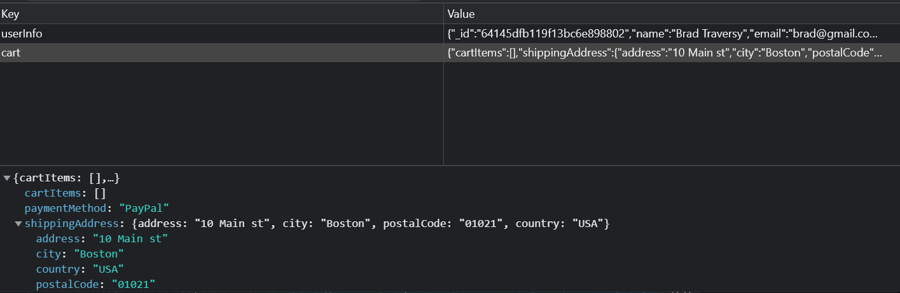

# Shipping Screen

Okay, so we had a little detour with the user authentication stuff, but now we're back on track in the checkout process. We need to create a shipping screen and functionality for when the user is ready to checkout their items. Let's start by going into the `cartSlice.js` file.

From here, let's add both `shippingAddress` and `paymentMethod` to the initial state. We'll also add a new `saveShippingAddress` action that will update the shipping address in the state.

```js
// Add shippingAddress and paymentMethod to the initial state
const initialState = localStorage.getItem('cart')
  ? JSON.parse(localStorage.getItem('cart'))
  : { cartItems: [], shippingAddress: {}, paymentMethod: 'PayPal' };
```

Then add the function `saveShippingAddress` right under the `removeFromCart` function and export the new function.

```js
saveShippingAddress: (state, action) => {
  state.shippingAddress = action.payload
  localStorage.setItem('cart', JSON.stringify(state))
},

export const { addToCart, removeFromCart, saveShippingAddress } = cartSlice.actions;
```

We are just going to add the shipping address to the state and then save it to local storage.

Now, let's create a `ShippingScreen.js` file in the `screens` folder. Add the following code to just display the screen:

```js
import { useState } from 'react';
import { Form, Button } from 'react-bootstrap';
import FormContainer from '../components/FormContainer';

const ShippingScreen = () => {
  const [address, setAddress] = useState('');
  const [city, setCity] = useState('');
  const [postalCode, setPostalCode] = useState('');
  const [country, setCountry] = useState('');

  const submitHandler = (e) => {
    e.preventDefault();
    console.log('submitHandler');
  };

  return (
    <FormContainer>
      <h1>Shipping</h1>
      <Form onSubmit={submitHandler}>
        <Form.Group className='my-2' controlId='address'>
          <Form.Label>Address</Form.Label>
          <Form.Control
            type='text'
            placeholder='Enter address'
            value={address}
            required
            onChange={(e) => setAddress(e.target.value)}
          ></Form.Control>
        </Form.Group>

        <Form.Group className='my-2' controlId='city'>
          <Form.Label>City</Form.Label>
          <Form.Control
            type='text'
            placeholder='Enter city'
            value={city}
            required
            onChange={(e) => setCity(e.target.value)}
          ></Form.Control>
        </Form.Group>

        <Form.Group className='my-2' controlId='postalCode'>
          <Form.Label>Postal Code</Form.Label>
          <Form.Control
            type='text'
            placeholder='Enter postal code'
            value={postalCode}
            required
            onChange={(e) => setPostalCode(e.target.value)}
          ></Form.Control>
        </Form.Group>

        <Form.Group className='my-2' controlId='country'>
          <Form.Label>Country</Form.Label>
          <Form.Control
            type='text'
            placeholder='Enter country'
            value={country}
            required
            onChange={(e) => setCountry(e.target.value)}
          ></Form.Control>
        </Form.Group>

        <Button type='submit' variant='primary'>
          Continue
        </Button>
      </Form>
    </FormContainer>
  );
};

export default ShippingScreen;
```

We are just displaying a form with some fields for shipping. Now, let's add this screen to the router in the `index.js` file.

```js
import ShippingScreen from './screens/ShippingScreen';

<Route path='/shipping' element={<ShippingScreen />} />;
```

You should now be able to see the shipping screen when you click checkout in your cart.

## Getting the Shipping Address from the State

We want this form to be pre-filled if the user has already entered their shipping address. We can do this by using the `useSelector` hook to get the shipping address from the state. We'll also need to import the `useDispatch` hook to dispatch the `saveShippingAddress` action as well as the action itself. Also import `useNavigate` from `react-router-dom` so we can navigate to the payment screen after the user submits the shipping address.

```js
import { useDispatch, useSelector } from 'react-redux';
import { useNavigate } from 'react-router-dom';
import { saveShippingAddress } from '../slices/cartSlice';
```

To get the shipping details from the state, add the following 2 lines above all of the `useState` declarations:

```js
const cart = useSelector((state) => state.cart);
const { shippingAddress } = cart;
```

Now, in the `useState` declarations, we can set the initial values to the shipping address from the state. If the shipping address is empty, then we'll just set the initial values to an empty string.

```js
const [address, setAddress] = useState(shippingAddress.address || '');
const [city, setCity] = useState(shippingAddress.city || '');
const [postalCode, setPostalCode] = useState(shippingAddress.postalCode || '');
const [country, setCountry] = useState(shippingAddress.country || '');
```

Then initialize both `navigate` and `dispatch` under that:

```js
const dispatch = useDispatch();
const navigate = useNavigate();
```

In the `submitHandler` function, we need to dispatch the `saveShippingAddress` action and then navigate to the payment screen.

```js
const submitHandler = (e) => {
  e.preventDefault();
  dispatch(saveShippingAddress({ address, city, postalCode, country }));
  navigate('/payment');
};
```

Right now, you may get an error that says "Cannot read properties of undefined (reading 'address')". This is because the shipping address is not in the state yet.

Open your browser's developer tools and go to the Application tab. Then click on Local Storage and delete the `cart` item. Refresh the page and you should be able to enter your shipping address.

If you submit the form, you will then be sent to `/payment`. We have not created this screen or route yet, so you will see an error, which is fine right now. What I want you to do is look in your Redux state and see if the shipping address is there. You can do this by opening the Redux DevTools and looking at the state. You should see the shipping address in the state.



Click the browser's back button and you should see your form filled in and it will stay filled in even if you refresh the page.

## Login Prompt

What is really cool is if you log out and then add some cart items and click `checkout`, you will be redirected to the login screen. After you log in, you will be redirected back to the shipping screen.

One thing we don't want though is for people to be able to access the shipping screen without being logged in. In the next lesson, we will address that.
