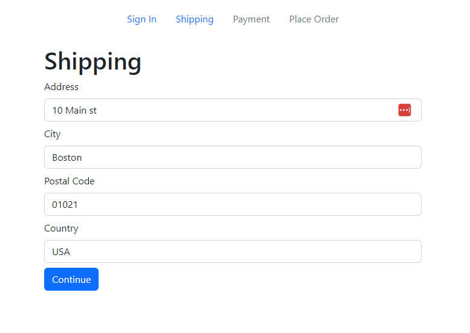

# Checkout Steps Component

We are going to create a component that will display the checkout steps and highlight the current step. This helps the user to know where they are in the checkout process.

Create a new file in the `components` folder called `CheckoutSteps.js` and add the following code:

```js
import React from 'react';
import { Nav } from 'react-bootstrap';
import { LinkContainer } from 'react-router-bootstrap';

const CheckoutSteps = ({ step1, step2, step3, step4 }) => {
  return (
    <Nav className='justify-content-center mb-4'>
      <Nav.Item>
        {step1 ? (
          <LinkContainer to='/login'>
            <Nav.Link>Sign In</Nav.Link>
          </LinkContainer>
        ) : (
          <Nav.Link disabled>Sign In</Nav.Link>
        )}
      </Nav.Item>

      <Nav.Item>
        {step2 ? (
          <LinkContainer to='/shipping'>
            <Nav.Link>Shipping</Nav.Link>
          </LinkContainer>
        ) : (
          <Nav.Link disabled>Shipping</Nav.Link>
        )}
      </Nav.Item>

      <Nav.Item>
        {step3 ? (
          <LinkContainer to='/payment'>
            <Nav.Link>Payment</Nav.Link>
          </LinkContainer>
        ) : (
          <Nav.Link disabled>Payment</Nav.Link>
        )}
      </Nav.Item>

      <Nav.Item>
        {step4 ? (
          <LinkContainer to='/placeorder'>
            <Nav.Link>Place Order</Nav.Link>
          </LinkContainer>
        ) : (
          <Nav.Link disabled>Place Order</Nav.Link>
        )}
      </Nav.Item>
    </Nav>
  );
};

export default CheckoutSteps;
```

This component is pretty simple. It takes in four props, `step1`, `step2`, `step3`, and `step4`. These props are booleans that determine whether the step is completed or not. If the step is completed, the user can click on the step to go back to that step. If the step is not completed, the step is disabled and the user cannot click on it.

## Usage

Let's use this component in the `ShippingScreen.js` file. Import the component at the top of the file:

```js
import CheckoutSteps from '../components/CheckoutSteps';
```

Then add the component below the `FormContainer` component:

```js
<CheckoutSteps step1 step2 />
```

Now, you should see the steps with both the `Sign In` and `Shipping` steps highlighted.


