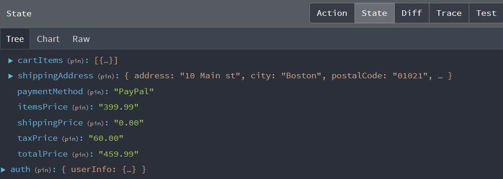

# Payment Method Slice & Screen

The Payment Method screen is where the customer selects the payment method they want to use to pay for their order. It is the next step in the checkout process after the Shipping Method screen.

Let's start in our `cartSlice.js` file. Make sure that you have `paymentMethod` in the `initialState` object:

```js
const initialState = localStorage.getItem('cart')
  ? JSON.parse(localStorage.getItem('cart'))
  : { cartItems: [], shippingAddress: {}, paymentMethod: 'PayPal' };
```

We have the default set to `PayPal`.

Next, we need to add a `savePaymentMethod` case to our `cartReducer`:

```js
savePaymentMethod: (state, action) => {
  state.paymentMethod = action.payload;
  localStorage.setItem('cart', JSON.stringify(state));
};
```

Be sure to export this case from the reducer:

```js
export const {
  addToCart,
  removeFromCart,
  saveShippingAddress,
  savePaymentMethod,
} = cartSlice.actions;
```

Now, let's create a new file in our `screens` folder called `PaymentScreen.js`.

Let's add the code to display the payment method screen:

```js
import { useState } from 'react';
import { Form, Button, Col } from 'react-bootstrap';
import FormContainer from '../components/FormContainer';
import Checkouts from '../components/CheckoutSteps';

const PaymentScreen = () => {
  const [paymentMethod, setPaymentMethod] = useState('PayPal');

  return (
    <FormContainer>
      <CheckoutSteps step1 step2 step3 />
      <h1>Payment Method</h1>
      <Form>
        <Form.Group>
          <Form.Label as='legend'>Select Method</Form.Label>
          <Col>
            <Form.Check
              className='my-2'
              type='radio'
              label='PayPal or Credit Card'
              id='PayPal'
              name='paymentMethod'
              value='PayPal'
              checked
              onChange={(e) => setPaymentMethod(e.target.value)}
            ></Form.Check>
          </Col>
        </Form.Group>

        <Button type='submit' variant='primary'>
          Continue
        </Button>
      </Form>
    </FormContainer>
  );
};

export default PaymentScreen;
```

## Add to Router

Open the `index.js` file in the `src` folder and add the following route:

```js
import PaymentScreen from './screens/PaymentScreen';

{
  /* Registered users */
}
<Route path='' element={<PrivateRoute />}>
  <Route path='/shipping' element={<ShippingScreen />} />
  <Route path='/payment' element={<PaymentScreen />} /> {/* Add this line */}
</Route>;
```

Make sure it is inside the `PrivateRoute` component.

If you go to the `/payment` route now, you should see the Payment Method screen.

## Check Shipping Address

We want to redirect the user if there is no shipping address. Let's add a check to the `PaymentScreen` component:

Import the following:

```js
import { useState, useEffect } from 'react';
import { useNavigate } from 'react-router-dom';
import { useDispatch, useSelector } from 'react-redux';
```

Add this code to the component, right above the state:

```js
const navigate = useNavigate();
const cart = useSelector((state) => state.cart);
const { shippingAddress } = cart;

useEffect(() => {
  if (!shippingAddress.address) {
    navigate('/shipping');
  }
}, [navigate, shippingAddress]);

const [paymentMethod, setPaymentMethod] = useState('PayPal');
```

We are checking to see if the `shippingAddress` object has an `address` property. If it doesn't, we redirect the user to the `/shipping` route. We also need to add `navigate` to the dependency array of the `useEffect` hook. This will make sure that the `useEffect` hook runs when the `navigate` function changes. e also need to add shippingAddress since we are using it in the `useEffect` hook.

You can test this by removing your cart state from local storage and going to the `/payment` route. You should be redirected to the `/shipping` route.

## Save Payment Method

Now, we need to save the payment method to the state.

import the `savePaymentMethod` action from the `cartSlice`:

```js
import { savePaymentMethod } from '../slices/cartSlice';
```

Add the following code under the useState:

```js
const dispatch = useDispatch();

const submitHandler = (e) => {
  e.preventDefault();
  dispatch(savePaymentMethod(paymentMethod));
  navigate('/placeorder');
};
```

Add the handler to the `Form` component:

```js
<Form onSubmit={submitHandler}>
```

Now when you submit, it should save the payment method to the state and redirect you to the `/placeorder` route, which we will create soon.

Check your state and you should have PayPal saved as the payment method.



If you want to add another method such as Stripe, you can add another `Form.Check` component and add the `onChange` handler to save the payment method to the state. You would have to implement the Stripe API and payment system. We are going to focus on PayPal, which does also allow customers to pay with a credit card.
