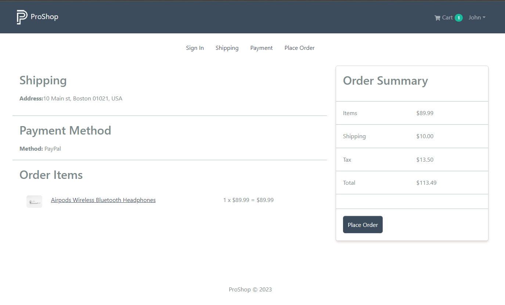
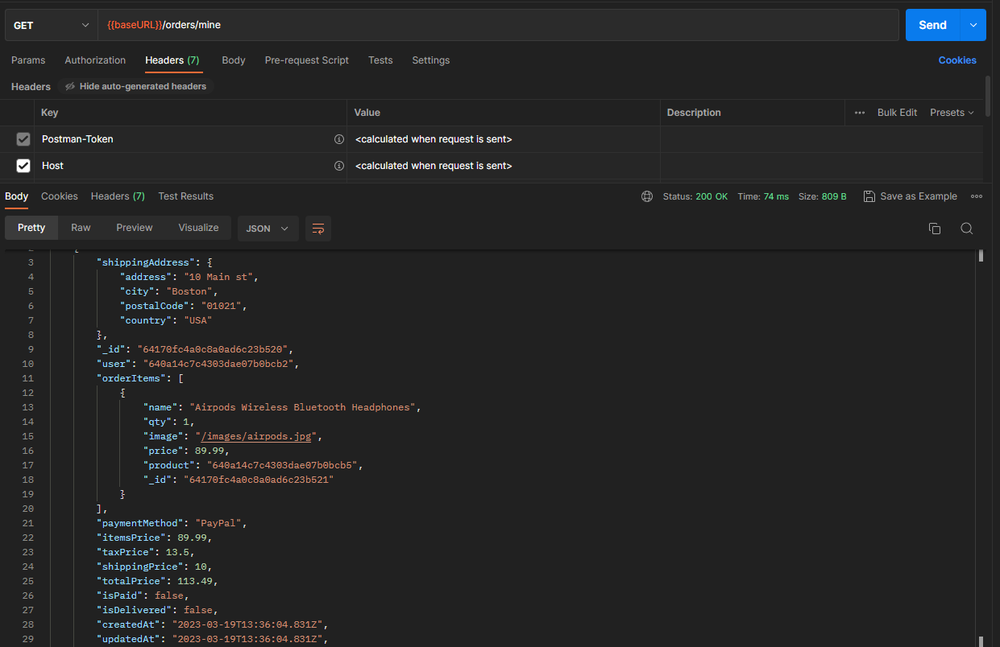

# Creating an Order

In the last lesson, we added the order state and we started the place order screen. In this lesson, we will finish the place order screen and we will be able to add an order to the database through the API. We will not do the payment process just yet, but it will add the order.

In the `frontend/screens/PlaceOrderScreen.jsx` file, we need a bunch more imports:

```js
import React, { useEffect } from 'react';
import { Link, useNavigate } from 'react-router-dom';
import { toast } from 'react-toastify';
import { Button, Row, Col, ListGroup, Image, Card } from 'react-bootstrap';
import { useDispatch, useSelector } from 'react-redux';
import Message from '../components/Message';
import CheckoutSteps from '../components/CheckoutSteps';
import Loader from '../components/Loader';
import { useCreateOrderMutation } from '../slices/ordersApiSlice';
import { clearCartItems } from '../slices/cartSlice';
```

We already have the cart state information, so let's start on the output.

Replace the `Column` in the first `Col` with the following:

```js
<ListGroup variant='flush'>
  <ListGroup.Item>
    <h2>Shipping</h2>
    <p>
      <strong>Address:</strong>
      {cart.shippingAddress.address}, {cart.shippingAddress.city} {
        cart.shippingAddress.postalCode
      }, {cart.shippingAddress.country}
    </p>
  </ListGroup.Item>

  <ListGroup.Item>
    <h2>Payment Method</h2>
    <strong>Method: </strong>
    {cart.paymentMethod}
  </ListGroup.Item>

  <ListGroup.Item>
    <h2>Order Items</h2>
    {cart.cartItems.length === 0 ? (
      <Message>Your cart is empty</Message>
    ) : (
      <ListGroup variant='flush'>
        {cart.cartItems.map((item, index) => (
          <ListGroup.Item key={index}>
            <Row>
              <Col md={1}>
                <Image src={item.image} alt={item.name} fluid rounded />
              </Col>
              <Col>
                <Link to={`/product/${item.product}`}>{item.name}</Link>
              </Col>
              <Col md={4}>
                {item.qty} x ${item.price} = ${item.qty * item.price}
              </Col>
            </Row>
          </ListGroup.Item>
        ))}
      </ListGroup>
    )}
  </ListGroup.Item>
</ListGroup>
```

You will see a summary of shipping, payment method, and order items.

Replace the second `Column` with the following:

```js
<Card>
  <ListGroup variant='flush'>
    <ListGroup.Item>
      <h2>Order Summary</h2>
    </ListGroup.Item>
    <ListGroup.Item>
      <Row>
        <Col>Items</Col>
        <Col>${cart.itemsPrice}</Col>
      </Row>
    </ListGroup.Item>
    <ListGroup.Item>
      <Row>
        <Col>Shipping</Col>
        <Col>${cart.shippingPrice}</Col>
      </Row>
    </ListGroup.Item>
    <ListGroup.Item>
      <Row>
        <Col>Tax</Col>
        <Col>${cart.taxPrice}</Col>
      </Row>
    </ListGroup.Item>
    <ListGroup.Item>
      <Row>
        <Col>Total</Col>
        <Col>${cart.totalPrice}</Col>
      </Row>
    </ListGroup.Item>
    <ListGroup.Item>
      {error && <Message variant='danger'>{error}</Message>}
    </ListGroup.Item>
    <ListGroup.Item>
      <Button
        type='button'
        className='btn-block'
        disabled={cart.cartItems === 0}
        onClick={placeOrderHandler}
      >
        Place Order
      </Button>
      {isLoading && <Loader />}
    </ListGroup.Item>
  </ListGroup>
</Card>
```

You will get an error because there are a few things missing.

We need to bring in the `useCreateOrderMutation` hook from the `ordersApiSlice` file.

```js
const [createOrder, { isLoading, error }] = useCreateOrderMutation();
```

From here we get the `createOrder` function and the `isLoading` and `error` states.

## Place Order Handler

The button is calling the `placeOrderHandler` function. Let's create that function as well as initialize `dispatch` right under the `useEffect`:

```js
const dispatch = useDispatch();
const placeOrderHandler = async () => {
  try {
    const res = await createOrder({
      orderItems: cart.cartItems,
      shippingAddress: cart.shippingAddress,
      paymentMethod: cart.paymentMethod,
      itemsPrice: cart.itemsPrice,
      shippingPrice: cart.shippingPrice,
      taxPrice: cart.taxPrice,
      totalPrice: cart.totalPrice,
    }).unwrap();
    dispatch(clearCartItems());
    navigate(`/order/${res._id}`);
  } catch (err) {
    toast.error(err);
  }
};
```

This will handle the order creation and then clear the cart items and navigate to the order screen.

Your screen should look like this:



## Test the Order Creation

Now, click the `Place Order` button. You will be redirected to something like `http://localhost:3000/order/64170fc4a0c8a0ad6c23b520`. We have not created that route yet. Stay on that page, because we are going to work on that next.

The order should have been created in the database.

You can check either by using Compass/Atlas or you can make a request to `http://localhost:5000/api/orders/mine` to see the order. Of course, you need to authenticate first with that user and send the JWT cookie.

it will look like this:



Notice that the `isPaid` and `isDelivered` are both `false`. We will handle those in the coming lessons.

You should also be able to go to `http://localhost:5000/api/orders/YOUR_ORDER_ID` and see the order.
