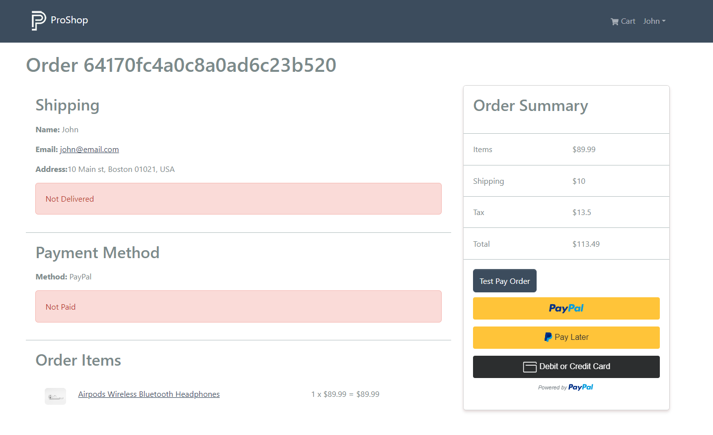
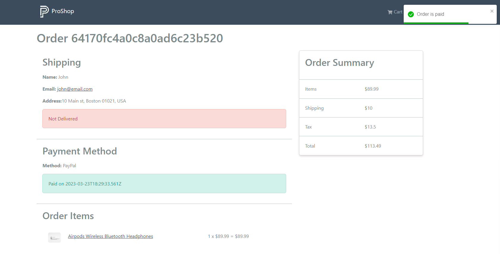
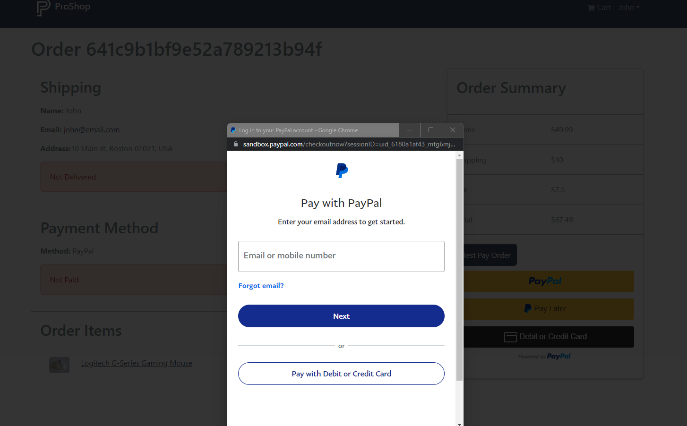

# PayPal Buttons

In this lesson, we will add the PayPal buttons as well as a test approve button that will simply mark the order as paid without having to go through PayPal.

Let's add the buttons. Add this where the "PAY ORDER PLACEHOLDER" is in the `OrderScreen.js` file:

```js
{
  !order.isPaid && (
    <ListGroup.Item>
      {loadingPay && <Loader />}

      {isPending ? (
        <Loader />
      ) : (
        <div>
          <Button style={{ marginBottom: '10px' }} onClick={onApproveTest}>
            Test Pay Order
          </Button>
          <div>
            <PayPalButtons
              createOrder={createOrder}
              onApprove={onApprove}
              onError={onError}
            ></PayPalButtons>
          </div>
        </div>
      )}
    </ListGroup.Item>
  );
}
```

This will display the buttons if the order is not paid. We will have a regular button to test with. This will just call the `onApproveTest` function. We will also have the real PayPal button. This will call the `createOrder` function when the button is clicked. We will create that in a minute. It will then call the `onApprove` function when the payment is approved. It will also call the `onError` function if there is an error.

## Payment Approval

Add the following function under the `useEffect` hook:

```js
function onApprove(data, actions) {
  return actions.order.capture().then(async function (details) {
    try {
      await payOrder({ orderId, details });
      refetch();
      toast.success('Order is paid');
    } catch (err) {
      toast.error(err?.data?.message || err.error);
    }
  });
}
```

This function will be called when the user approves the payment. It will capture the payment and then call the `payOrder` mutation based on the order ID and order details. If there is an error, it will display a toast message. If there is no error, it will refetch the order details and display a toast message.

We are also going to add a function to use for testing to simulate a successful payment.

```js
async function onApproveTest() {
  await payOrder({ orderId, details: { payer: {} } });
  refetch();

  toast.success('Order is paid');
}
```

This function will call the `payOrder` mutation with an empty object for the `details` parameter. This will simulate a successful payment.

We need to create an error handler. Add the following function:

```js
function onError(err) {
  toast.error(err.message);
}
```


We need to create a handler for the `createOrder` function. Add the following above the return:

```js
function createOrder(data, actions) {
  return actions.order
    .create({
      purchase_units: [
        {
          amount: { value: order.totalPrice },
        },
      ],
    })
    .then((orderID) => {
      return orderID;
    });
}
```

This function will run when the PayPal button is clicked. It will use the `order.totalPrice` to set the amount of the order. It will then return the order ID

## Testing

Now when you go to the page, you should see the PayPal buttons and the test buttons:



Click the test button. It will set the order to paid and you will see a toas message.

The screen will now look like this:



Let's test the real button now.

Add some items to your cart and go through the process. When you get to the payment screen, click the PayPal button. You should see the PayPal screen:



From here, use your sandbox personal account to pay.

Once you go through the process, your order should be paid.

We now have a fully functional PayPal payment system. Users can also pay with a dredit or debit card through PayPal.