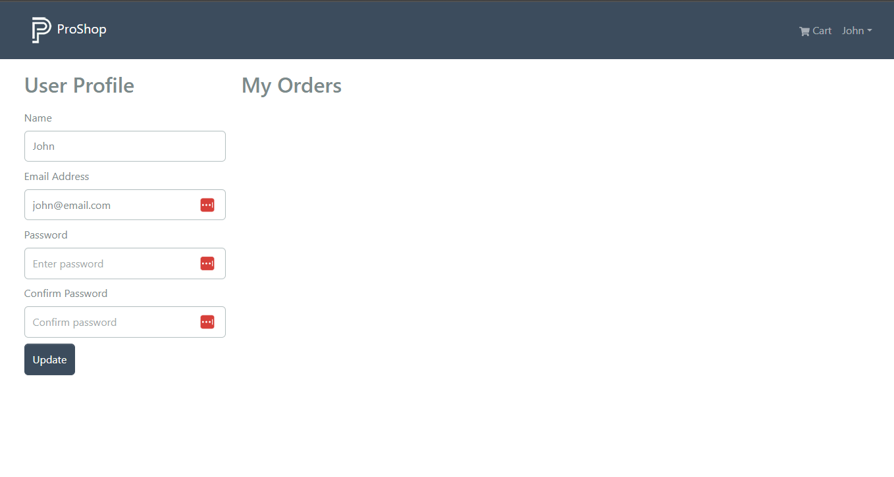
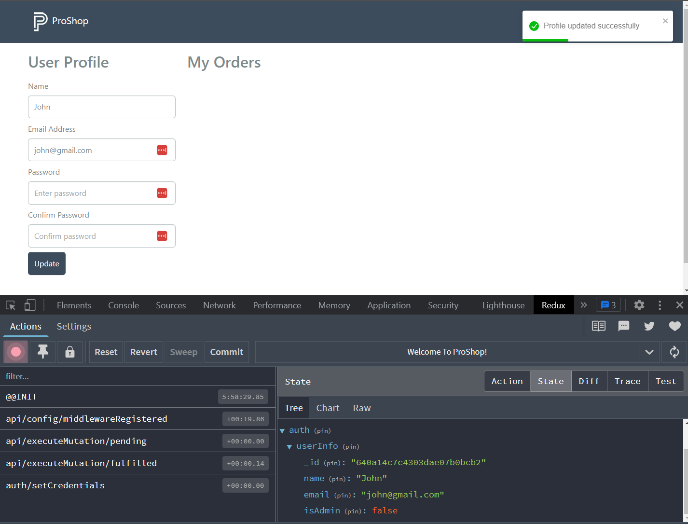

# User Profile

Ultimatley, we want to have a form on the user profile to update their info as well as show their orders. So let's start to create the profile logic and screen.

Open the `src/slices/usersApiSlice.js` file and add the following reducer:

```js
profile: builder.mutation({
  query: (data) => ({
    url: `${USERS_URL}/profile`,
    method: 'PUT',
    body: data,
  }),
}),
```

This is going to be a PUT request to the `/api/users/profile` endpoint. This will update the user's profile. We already have the backend route and controller setup for this.

Export it:

```js
export const {
  useLoginMutation,
  useLogoutMutation,
  useRegisterMutation,
  useProfileMutation,
} = usersApiSlice;
```

Now, open the `src/screens/ProfileScreen.js` file and add the following imports:

```js
import React, { useEffect, useState } from 'react';
import { Table, Form, Button, Row, Col } from 'react-bootstrap';
import { LinkContainer } from 'react-router-bootstrap';
import { useDispatch, useSelector } from 'react-redux';

import { toast } from 'react-toastify';
import Message from '../components/Message';
import Loader from '../components/Loader';
import { useProfileMutation } from '../slices/usersApiSlice';
import { setCredentials } from '../slices/authSlice';
```

Then, add the following code:

```js
const ProfileScreen = () => {
  const [name, setName] = useState('');
  const [email, setEmail] = useState('');
  const [password, setPassword] = useState('');
  const [confirmPassword, setConfirmPassword] = useState('');

  const { userInfo } = useSelector((state) => state.auth);

  useEffect(() => {
    setName(userInfo.name);
    setEmail(userInfo.email);
  }, [userInfo.email, userInfo.name]);

  const submitHandler = async (e) => {
    e.preventDefault();
    console.log('submit');
  };

  return (
    <Row>
      <Col md={3}>
        <h2>User Profile</h2>

        <Form onSubmit={submitHandler}>
          <Form.Group className='my-2' controlId='name'>
            <Form.Label>Name</Form.Label>
            <Form.Control
              type='name'
              placeholder='Enter name'
              value={name}
              onChange={(e) => setName(e.target.value)}
            ></Form.Control>
          </Form.Group>

          <Form.Group className='my-2' controlId='email'>
            <Form.Label>Email Address</Form.Label>
            <Form.Control
              type='email'
              placeholder='Enter email'
              value={email}
              onChange={(e) => setEmail(e.target.value)}
            ></Form.Control>
          </Form.Group>

          <Form.Group className='my-2' controlId='password'>
            <Form.Label>Password</Form.Label>
            <Form.Control
              type='password'
              placeholder='Enter password'
              value={password}
              onChange={(e) => setPassword(e.target.value)}
            ></Form.Control>
          </Form.Group>

          <Form.Group className='my-2' controlId='confirmPassword'>
            <Form.Label>Confirm Password</Form.Label>
            <Form.Control
              type='password'
              placeholder='Confirm password'
              value={confirmPassword}
              onChange={(e) => setConfirmPassword(e.target.value)}
            ></Form.Control>
          </Form.Group>

          <Button type='submit' variant='primary'>
            Update
          </Button>
        </Form>
      </Col>
      <Col md={9}>
        <h2>My Orders</h2>
      </Col>
    </Row>
  );
};

export default ProfileScreen;
```

Here, we are setting the component state to the form fields. We are fetching the current user's name and email from the global state and adding it to the form fields. We are also adding a submit handler that will be used to update the user's profile.

### Add the route

Open the `src/App.js` file and add the following route:

```js
import ProfileScreen from './screens/ProfileScreen';
```

```jsx
<Route path='' element={<PrivateRoute />}>
  {// Other routes }
  <Route path='/profile' component={ProfileScreen} />
</Route>
```

Go to the profile link in the dropdown and you should see a form with the logged in user's info. As well as just the heading for the orders.



## Update User Profile

Let's add the logic to update the user's profile.

In the function add the following code:

```js
const [updateProfile, { isLoading: loadingUpdateProfile }] =
  useProfileMutation();
```

This is going to be a mutation from the `usersApiSlice` that we created earlier. The name `updateProfile` is what we are calling it, but it could be called anything. We are also destructuring the `isLoading` property from the mutation. This will be used to show a loading spinner while the request is being made.

Now, let's add a `useEffect` hook to handle the response from the mutation:

```js
useEffect(() => {
  setName(userInfo.name);
  setEmail(userInfo.email);
}, [userInfo.email, userInfo.name]);
```

This is going to be called when the `userInfo` changes. We are setting the form fields to the user's info.

We need to add the logic to the submit handler:

```js
const dispatch = useDispatch();

const submitHandler = async (e) => {
  e.preventDefault();
  if (password !== confirmPassword) {
    toast.error('Passwords do not match');
  } else {
    try {
      const res = await updateProfile({
        _id: userInfo._id,
        name,
        email,
        password,
      }).unwrap();

      dispatch(setCredentials({ ...res }));
      toast.success('Profile updated successfully');
    } catch (err) {
      toast.error(err?.data?.message || err.error);
    }
  }
};
```

Here, we are updating the profile with the form fields and then dispatching the `setCredentials` action to update the global state. We are also showing a toast message to the user.

Last thing I will do here is just add a loader right below the button if the request is being made:

```jsx
  <Button type="submit" variant="primary">
    Update
  </Button>
  {// Add this line}
  {loadingUpdateProfile && <Loader />}
</Form>
```

# Testing

Now, let's test by changing the email of the user. My email right now is `john@email.com`. I am going to change it to `john@gmail.com`

As you can see, I get a success message and the email is updated in my state and in my form.



In the next lesson, we will add the users orders to the page.
