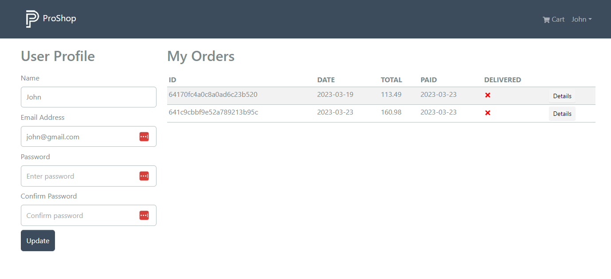

# Display Order History

We want the show the user's orders on their profile page.

You should already have the backend route to get the user's order. If you do not, this is the controller funcion:

```js
// @desc    Get logged in user orders
// @route   GET /api/orders/myorders
// @access  Private
const getMyOrders = asyncHandler(async (req, res) => {
  const orders = await Order.find({ user: req.user._id });
  res.json(orders);
});
```

It is very simple, we are just looking up orders by the user ID in the token.

## Redux Reducer

Let's open the `ordersApiSlice.js` file and add a new function to get the user's orders:

```js
getMyOrders: builder.query({
  query: () => ({
    url: `${ORDERS_URL}/mine`,
  }),
  keepUnusedDataFor: 5,
}),
```

Export it along with the rest of the functioins:

```js
export const {
  useCreateOrderMutation,
  useGetOrderDetailsQuery,
  usePayOrderMutation,
  useGetPaypalClientIdQuery,
  useGetMyOrdersQuery,
} = ordersApiSlice;
```

## Profile Screen

Now go to the `ProfileScreen.js` file and import the `useGetMyOrdersQuery` function:

```js
import { useGetMyOrdersQuery } from '../slices/ordersApiSlice';
```

Add this line under where we get the `userInfo`:

```js
const { data: orders, isLoading, error } = useGetMyOrdersQuery();
```

Now we can use the `orders` variable to display the user's orders. Find the `<Col>` with the `<h2>My Orders</h2>` line. The entire `<Col>` should look like this:

````js
<Col md={9}>
        <h2>My Orders</h2>
        {isLoading ? (
          <Loader />
        ) : error ? (
          <Message variant='danger'>
            {error?.data?.message || error.error}
          </Message>
        ) : (
          <Table striped table hover responsive className='table-sm'>
            <thead>
              <tr>
                <th>ID</th>
                <th>DATE</th>
                <th>TOTAL</th>
                <th>PAID</th>
                <th>DELIVERED</th>
                <th></th>
              </tr>
            </thead>
            <tbody>
              {orders.map((order) => (
                <tr key={order._id}>
                  <td>{order._id}</td>
                  <td>{order.createdAt.substring(0, 10)}</td>
                  <td>{order.totalPrice}</td>
                  <td>
                    {order.isPaid ? (
                      order.paidAt.substring(0, 10)
                    ) : (
                       <FaTimes style={{ color: 'red' }} />
                    )}
                  </td>
                  <td>
                    {order.isDelivered ? (
                      order.deliveredAt.substring(0, 10)
                    ) : (
                       <FaTimes style={{ color: 'red' }} />
                    )}
                  </td>
                  <td>
                    <LinkContainer to={`/order/${order._id}`}>
                      <Button className='btn-sm' variant='light'>
                        Details
                      </Button>
                    </LinkContainer>
                  </td>
                </tr>
              ))}
            </tbody>
          </Table>
        )}
      </Col>
      ```
````

Now, if you go to the profile, you should see all of your orders:



It shows some basic info as well as a details button to take you to the order details page.

I like to have my table columns centered, so I am going to open `assets/styles/index.css` and add this:

```css
table td,
table th {
  text-align: center;
}
```
