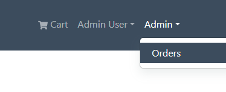

# Admin Route Component

Now we will start implementing the admin functionality. We already have the admin middleware setup in the backend.

To make a user an admin, you just need to change the `isAdmin` property to `true` in the database.

If you have been following along, you should have a user called `admin@email.com` with the password of `123456`. This user is an admin.

We need a way to protect certain routes so that only admins can access them. We have a `PrivateRoute` component, but that only protects pages from users that are not logged in at all. We will create a new component called `AdminRoute`.

Create a new file named `AdminRoute.js` in the `frontend/src/components` folder.

Add the following code to the file:

```js
import { Navigate, Outlet } from 'react-router-dom';
import { useSelector } from 'react-redux';

const AdminRoute = () => {
  const { userInfo } = useSelector((state) => state.auth);
  return userInfo && userInfo.isAdmin ? (
    <Outlet />
  ) : (
    <Navigate to='/login' replace />
  );
};
export default AdminRoute;
```

Here, we are simply getting the user from the state and checking if they are admin. If they are not, we redirect them.

The `replace` prop in the `Navigate` component will replace the current route in the history stack. This means that if the user clicks the back button, they will not be redirected back to the admin route.

## Create `OrderListScreen` To Test

In the next lesson, we will create the screen to show all orders to admins. Let's just create the screen for now with an `h1` tag. Just so we can test that the admin route is working.

Create a new folder in the `screens` folder called `admin`. This is where we will put all the admin screens.

Create a new file called `OrderListScreen.js` in the `frontend/src/screens/admin` folder.

Add the following code to the file:

```js
  return (
    <>
      <h1>Orders</h1>
    </>
  );
};

export default OrderListScreen;
```

Now let's go to the `index.js` and bring in both the `AdminRoute` and `OrderListScreen` components.

```js
import AdminRoute from './components/AdminRoute';
import OrderListScreen from './screens/admin/OrderListScreen';
```

Add the following under the `PrivateRoute` component:

```js
{
  /* Admin users */
}
<Route path='' element={<AdminRoute />}>
  <Route path='/admin/orderlist' element={<OrderListScreen />} />
</Route>;
```

Now, go to the browser and go to `http://localhost:3000/admin/orderlist` while logged in as a regular user. You should be redirected to the home page.

Now, logout and login as the admin user that we created with the seeding data. Or just open Compass and change the `isAdmin` property to `true` for the user you want to make an admin.

Go to the same route again and you should see the `OrderListScreen` component.

## Add Admin Menu In Header

Let's add an admin dropdown menu in the header with a link to the orders page. Open up the `frontend/src/components/Header.js` file and add the following code right above the closing `</Nav>:

```js
{
  userInfo && userInfo.isAdmin && (
    <NavDropdown title='Admin' id='adminmenu'>
      <LinkContainer to='/admin/orderlist'>
        <NavDropdown.Item>Orders</NavDropdown.Item>
      </LinkContainer>
    </NavDropdown>
  );
}
```

Now you will have the link when you are logged in as an admin


