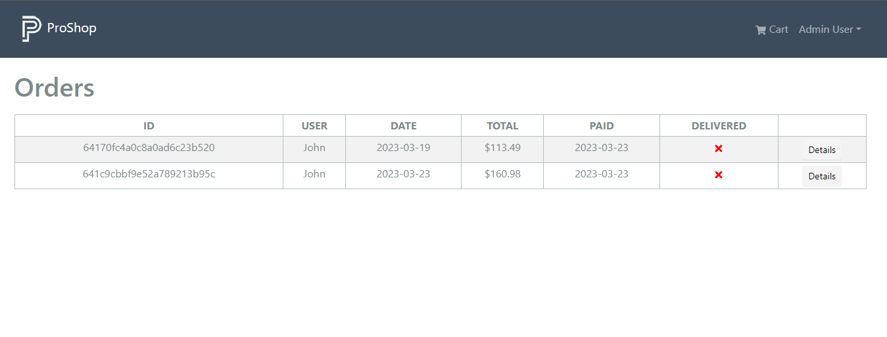

# List Orders (Admin)

In the last lesson, we created our `AdminRoute` component. We also created the `OrderListScreen` component to test it. In this lesson, we will finish that screen.

In the `backend/controllers/orderController.js` file, add this to the `getOrders` function:

```js
const getOrders = asyncHandler(async (req, res) => {
  const orders = await Order.find({}).populate('user', 'id name');
  res.json(orders);
});
```

Here, we are simply getting all the orders and populating the user field with the user's ID and name.

## `getOrders` Reducer

Open up the `frontend/src/slices/ordersApiSlice.js` file and add the following function/query:

```js
getOrders: builder.query({
  query: () => ({
    url: ORDERS_URL,
  }),
  keepUnusedDataFor: 5,
});
```

Export it along with the rest of the functions:

```js
export const {
  useCreateOrderMutation,
  useGetOrderDetailsQuery,
  usePayOrderMutation,
  useGetPaypalClientIdQuery,
  useGetMyOrdersQuery,
  useGetOrdersQuery,
} = ordersApiSlice;
```

## Order List Screen

We will now create a new screen to display all the orders. Create a new file called `OrderListScreen.js` in the `frontend/src/screens` folder.

Add the following code to the file:

```js
import { LinkContainer } from 'react-router-bootstrap';
import { Table, Button } from 'react-bootstrap';
import { FaTimes } from 'react-icons/fa';
import Message from '../components/Message';
import Loader from '../components/Loader';
import { useGetOrdersQuery } from '../slices/ordersApiSlice';

const OrderListScreen = () => {
  const { data: orders, isLoading, error } = useGetOrdersQuery();

  return (
    <>
      <h1>Orders</h1>
      {isLoading ? (
        <Loader />
      ) : error ? (
        <Message variant='danger'>
          {error?.data?.message || error.error}
        </Message>
      ) : (
        <Table striped bordered hover responsive className='table-sm'>
          <thead>
            <tr>
              <th>ID</th>
              <th>USER</th>
              <th>DATE</th>
              <th>TOTAL</th>
              <th>PAID</th>
              <th>DELIVERED</th>
              <th></th>
            </tr>
          </thead>
          <tbody>
            {orders.map((order) => (
              <tr key={order._id}>
                <td>{order._id}</td>
                <td>{order.user && order.user.name}</td>
                <td>{order.createdAt.substring(0, 10)}</td>
                <td>${order.totalPrice}</td>
                <td>
                  {order.isPaid ? (
                    order.paidAt.substring(0, 10)
                  ) : (
                    <FaTimes style={{ color: 'red' }} />
                  )}
                </td>
                <td>
                  {order.isDelivered ? (
                    order.deliveredAt.substring(0, 10)
                  ) : (
                    <FaTimes style={{ color: 'red' }} />
                  )}
                </td>
                <td>
                  <LinkContainer to={`/order/${order._id}`}>
                    <Button variant='light' className='btn-sm'>
                      Details
                    </Button>
                  </LinkContainer>
                </td>
              </tr>
            ))}
          </tbody>
        </Table>
      )}
    </>
  );
};

export default OrderListScreen;
```

As long as you are logged in as an admin, you should see a screen like this:



