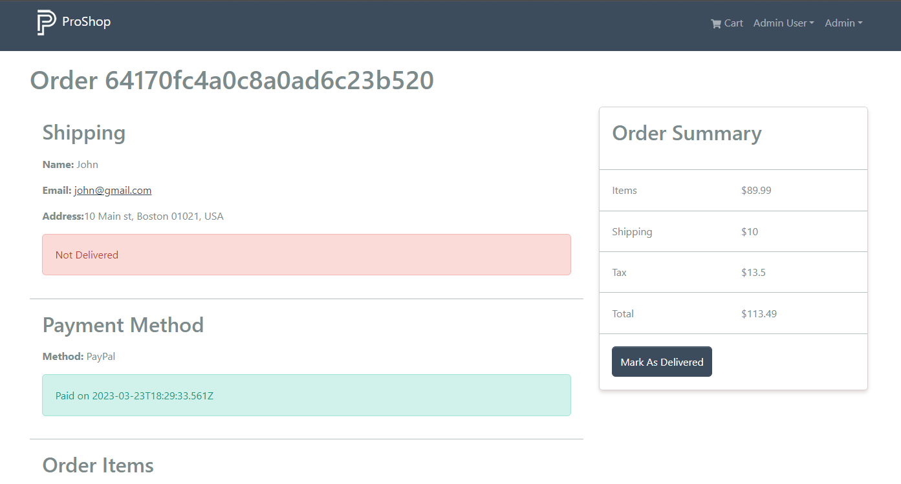
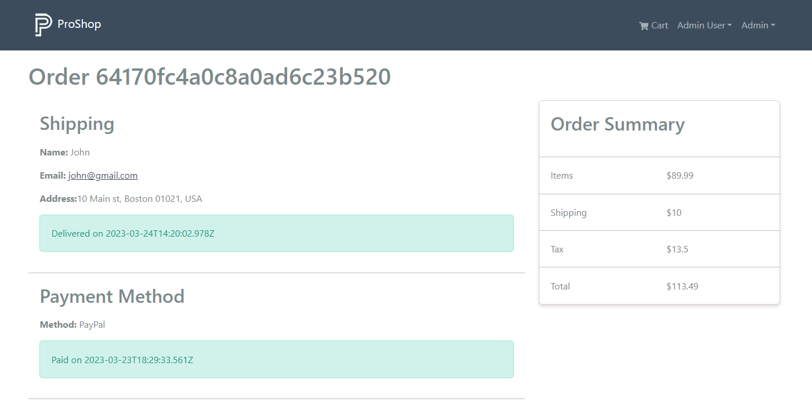

# Deliver Order

Now we want to be able to login as admin and mark the item as 'delivered'. We will add a button to the order details page that will update the order to 'delivered' and also update the database.

## Backend - Update Order To Delivered

Let's go to the `backend/controllers/orderController.js` file and add the code for the `updateOrderToDelivered` function:

```js
const updateOrderToDelivered = asyncHandler(async (req, res) => {
  const order = await Order.findById(req.params.id);

  if (order) {
    order.isDelivered = true;
    order.deliveredAt = Date.now();

    const updatedOrder = await order.save();

    res.json(updatedOrder);
  } else {
    res.status(404);
    throw new Error('Order not found');
  }
});
```

This is pretty self explanatory. We are finding the order by ID and then updating the `isDelivered` and `deliveredAt` fields. We then save the order and return it.

## `deliverOrder` Reducer

Let's add the following function/mutation to the `frontend/src/slices/ordersApiSlice.js` file:

```js
deliverOrder: builder.mutation({
  query: (orderId) => ({
    url: `${ORDERS_URL}/${orderId}/deliver`,
    method: 'PUT',
  }),
});
```

Export it:

```js
export const {
  useCreateOrderMutation,
  useGetOrderDetailsQuery,
  usePayOrderMutation,
  useGetPaypalClientIdQuery,
  useGetMyOrdersQuery,
  useGetOrdersQuery,
  useDeliverOrderMutation,
} = ordersApiSlice;
```

## Order Screen

Now, let's open up the `frontend/src/screens/OrderScreen.js` file.

Import the mutation:

```js
import {
  useGetOrderDetailsQuery,
  useGetPaypalClientIdQuery,
  usePayOrderMutation,
  useDeliverOrderMutation, // <--- import
} from '../slices/ordersApiSlice';
```

Add the following line:

```js
const [deliverOrder, { isLoading: loadingDeliver }] = useDeliverOrderMutation();
```

This will give use the `deliverOrder` function and a loading state, which we rename to `loadingDeliver`.

## Deliver Handler

Create a function to handle the deliver submit

```js
const deliverHandler = async () => {
  await deliverOrder(orderId);
  refetch();
};
```

We are just calling the `deliverOrder` function and passing in the `orderId`. We then refetch the order details.

Lastly, add the following JSX under where we check if the order is paid:

```js
{
  loadingDeliver && <Loader />;
}
{
  userInfo && userInfo.isAdmin && order.isPaid && !order.isDelivered && (
    <ListGroup.Item>
      <Button type='button' className='btn btn-block' onClick={deliverHandler}>
        Mark As Delivered
      </Button>
    </ListGroup.Item>
  );
}
```

Log in as admin and you should see a button to mark the order as delivered.



Clicking it will update the order in the database and also update the UI.


