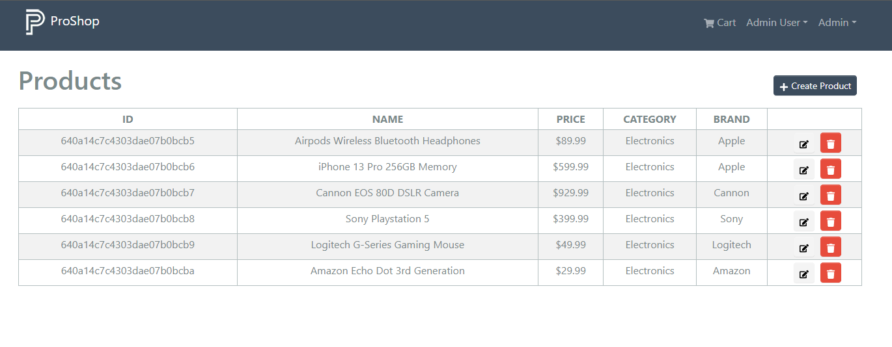

# List Products (Admin)

We will now work on having a screen that the admins can use to view all the products in the system.

There are a few steps we will take with pages like this because we are going to need pagination. We will also need to use this page for search results. Right now we will just focus on fetching all the products and displaying them.

We already have a simple route and controller function to get all the products. We also have a reducer in the `productsApiSlice.js` file to handle fetching products for the main part of the site. So right now, we just want to create the admin `productListScreen`.

Create a new file at `frontend/src/screens/admin/ProductListScreen.js` and add the following code:

```js
import { LinkContainer } from 'react-router-bootstrap';
import { Table, Button, Row, Col } from 'react-bootstrap';
import { FaEdit, FaPlus, FaTrash } from 'react-icons/fa';
import Message from '../../components/Message';
import Loader from '../../components/Loader';
import { useGetProductsQuery } from '../../slices/productsApiSlice';

const ProductListScreen = () => {
  const { data: products, isLoading, error, refetch } = useGetProductsQuery();

  const deleteHandler = () => {
    console.log('delete');
  };

  return (
    <>
      <Row className='align-items-center'>
        <Col>
          <h1>Products</h1>
        </Col>
        <Col className='text-end'>
          <Button className='btn-sm m-3'>
            <FaPlus /> Create Product
          </Button>
        </Col>
      </Row>

      {isLoading ? (
        <Loader />
      ) : error ? (
        <Message variant='danger'>{error}</Message>
      ) : (
        <>
          <Table striped bordered hover responsive className='table-sm'>
            <thead>
              <tr>
                <th>ID</th>
                <th>NAME</th>
                <th>PRICE</th>
                <th>CATEGORY</th>
                <th>BRAND</th>
                <th></th>
              </tr>
            </thead>
            <tbody>
              {products.map((product) => (
                <tr key={product._id}>
                  <td>{product._id}</td>
                  <td>{product.name}</td>
                  <td>${product.price}</td>
                  <td>{product.category}</td>
                  <td>{product.brand}</td>
                  <td>
                    <LinkContainer to={`/admin/product/${product._id}/edit`}>
                      <Button variant='light' className='btn-sm mx-2'>
                        <FaEdit />
                      </Button>
                    </LinkContainer>
                    <Button
                      variant='danger'
                      className='btn-sm'
                      onClick={() => deleteHandler(product._id)}
                    >
                      <FaTrash style={{ color: 'white' }} />
                    </Button>
                  </td>
                </tr>
              ))}
            </tbody>
          </Table>
          {/* PAGINATE PLACEHOLDER */}
        </>
      )}
    </>
  );
};

export default ProductListScreen;
```

We are using the `useGetProductsQuery` hook to fetch the products. For now, we just have a placeholder for the pagination and an empty `deleteHandler`. We will add those soon.

## Add Route

In the `frontend/src/index.js` file, add the following:

```js
import ProductListScreen from './screens/admin/ProductListScreen';

{
  /* Admin users */
}
<Route path='' element={<AdminRoute />}>
  {/*// ...other routes*/}
  <Route path='/admin/productlist' element={<ProductListScreen />} />
</Route>;
```

## Add Link

Open up the `frontend/src/components/Header.jsx` file and add the link to the admin dropdown. It should look like this:

```js
{
  userInfo && userInfo.isAdmin && (
    <NavDropdown title='Admin' id='adminmenu'>
      <LinkContainer to='/admin/productlist'>
        <NavDropdown.Item>Products</NavDropdown.Item>
      </LinkContainer>
      <LinkContainer to='/admin/orderlist'>
        <NavDropdown.Item>Orders</NavDropdown.Item>
      </LinkContainer>
    </NavDropdown>
  );
}
```

Now you can see a list of all products:


