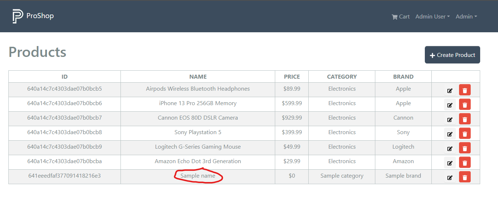

# Creating Products

Now that we can see all of the products as an admin, let's add the functionality to create new products.

As far as the frontend workflow, we will create a new product as an admin and it will automatically show up in the list of products with some sample data. Then we will edit the product and add the actual data.

## Backend Route and Controller

We need to head to the backend and, in the `controllers` folder, open the `productController.js` file. Create the following function and export it:

```js
// @desc    Create a product
// @route   POST /api/products
// @access  Private/Admin
const createProduct = asyncHandler(async (req, res) => {
  const product = new Product({
    name: 'Sample name',
    price: 0,
    user: req.user._id,
    image: '/images/sample.jpg',
    brand: 'Sample brand',
    category: 'Sample category',
    countInStock: 0,
    numReviews: 0,
    description: 'Sample description',
  });

  const createdProduct = await product.save();
  res.status(201).json(createdProduct);
});

module.exports = { getProducts, getProductById, createProduct };
```

So, this function will create the new product with some sample content for now. You will understand why we are doing this in a little bit. The image property is set to a sample image, which will be used if the user doesn't upload an image. So make sure that you have a sample image in the `backend/public/images` folder.

Open the `productRoutes.js` file and replace this line:

```js
router.route('/').get(getProducts);
```

with this:

```js
router.route('/').get(getProducts).post(protect, admin, createProduct);
```

Also, make sure that you import the `createProduct` function as well as the `protect` and `admin` middleware:

```js
import {
  getProducts,
  getProductById,
  createProduct,
} from '../controllers/productController.js';
import { protect, admin } from '../middleware/authMiddleware.js';
```

Now we can make a `POST` request to `/api/products` and create a new product.

## Frontend Route and Action

Now we need to head to the frontend and, open the `frontend/src/slices/productsApiSlice.js` file. Create the following action:

```js
createProduct: builder.mutation({
  query: () => ({
    url: `${PRODUCTS_URL}`,
    method: 'POST',
  }),
  invalidatesTags: ['Product'],
}),
```

The invalidateTags option is specifying that products should be removed from cache. That way we get fresh data.

Export it:

```js
export const {
  useGetProductsQuery,
  useGetProductDetailsQuery,
  useCreateProductMutation,
} = productsApiSlice;
```

Now we can dispatch this action to create a new product. Right now, we don't send any data because sample data is used first. I am using `invalidatesTags` to invalidate the cache for the `Product` tag. This will make sure that the cache is updated when we create a new product.

## ProducListScreen

Now open up the `frontend/src/screens/admin/ProductListScreen.js` file. Import `toast` and the `useCreateProductMutation` hook:

```js
import { toast } from 'react-toastify';
import {
  useGetProductsQuery,
  useCreateProductMutation,
} from '../../slices/productApiSlice';
```

Add the following in the `ProductListScreen` function:

```js
const [createProduct, { isLoading: loadingCreate }] =
  useCreateProductMutation();

const createProductHandler = async () => {
  if (window.confirm('Are you sure you want to create a new product?')) {
    try {
      await createProduct();
      refetch();
    } catch (err) {
      toast.error(err?.data?.message || err.error);
    }
  }
};
```

This will create a new product and refetch the products list.

Now we need to edit the create button and add the `onClick` handler:

```js
<Button className='my-3' onClick={createProductHandler}>
  <FaPlus /> Create Product
</Button>
```

We will also add the `loadingCreate` check right above where we check for `isLoading`

```js
  {loadingCreate && <Loader />} // Add this

   {isLoading ? (
        <Loader />
      ) : error ? (
        // ... rest of the code
```

Now click the create button. You should see a new product in the list, with the sample data.


