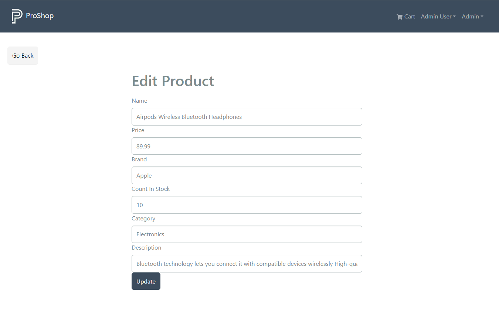

# Edit Product

The Edit Product page allows you to edit the details of a product.

## Backend Update Product

Let's go into the backend product controller and add the function to update product details.

```js
// @desc    Update a product
// @route   PUT /api/products/:id
// @access  Private/Admin
const updateProduct = asyncHandler(async (req, res) => {
  const { name, price, description, image, brand, category, countInStock } =
    req.body;

  const product = await Product.findById(req.params.id);

  if (product) {
    product.name = name;
    product.price = price;
    product.description = description;
    product.image = image;
    product.brand = brand;
    product.category = category;
    product.countInStock = countInStock;

    const updatedProduct = await product.save();
    res.json(updatedProduct);
  } else {
    res.status(404);
    throw new Error('Product not found');
  }
});
```

We are using the `findById` method to find the product by its id. If the product is found, we update the product details and save it to the database. If the product is not found, we throw an error.

Be sure to export the function:

```js
export { getProducts, getProductById, createProduct, updateProduct };
```

Now bring the function into the `productRoutes.js` file and add the route:

Replace this line:

```js
router.route('/:id').get(getProductById);
```

With this line:

```js
router.route('/:id').get(getProductById).put(protect, admin, updateProduct);
```

## Frontend Update Product

Now go to the `frontend/src/slice/productsApiSlice.js` file and add the function to update a product:

```js
 updateProduct: builder.mutation({
  query: (data) => ({
    url: `${PRODUCTS_URL}/${data.productId}`,
    method: 'PUT',
    body: data,
  }),
  invalidatesTags: ['Product'],
 }),
```

Export it:

```js
export const {
  useGetProductsQuery,
  useGetProductDetailsQuery,
  useCreateProductMutation,
  useUpdateProductMutation, // <--- Add this line
} = productsApiSlice;
```

Hopefully you have grasped the workflow here as far as adding a new function to the backend, adding a new slice and then adding the screen.

## Edit Product Screen

Let's create a new file at `frontend/src/screens/admin/ProductEditScreen.js` and add the following code:

```js
import { useState, useEffect } from 'react';
import { Link, useNavigate, useParams } from 'react-router-dom';
import { Form, Button } from 'react-bootstrap';
import Message from '../../components/Message';
import Loader from '../../components/Loader';
import FormContainer from '../../components/FormContainer';
import { toast } from 'react-toastify';
import {
  useGetProductDetailsQuery,
  useUpdateProductMutation,
} from '../../slices/productsApiSlice';

const ProductEditScreen = () => {
  const { id: productId } = useParams();

  const [name, setName] = useState('');
  const [price, setPrice] = useState(0);
  const [image, setImage] = useState('');
  const [brand, setBrand] = useState('');
  const [category, setCategory] = useState('');
  const [countInStock, setCountInStock] = useState(0);
  const [description, setDescription] = useState('');

  const {
    data: product,
    isLoading,
    refetch,
    error,
  } = useGetProductDetailsQuery(productId);

  const [updateProduct, { isLoading: loadingUpdate }] =
    useUpdateProductMutation();

  const navigate = useNavigate();

  const submitHandler = async (e) => {
    e.preventDefault();
    console.log('submit');
  };
  useEffect(() => {
    if (product) {
      setName(product.name);
      setPrice(product.price);
      setImage(product.image);
      setBrand(product.brand);
      setCategory(product.category);
      setCountInStock(product.countInStock);
      setDescription(product.description);
    }
  }, [product]);

  return (
    <>
      <Link to='/admin/productlist' className='btn btn-light my-3'>
        Go Back
      </Link>
      <FormContainer>
        <h1>Edit Product</h1>
        {loadingUpdate && <Loader />}
        {isLoading ? (
          <Loader />
        ) : error ? (
          <Message variant='danger'>{error}</Message>
        ) : (
          <Form onSubmit={submitHandler}>
            <Form.Group controlId='name'>
              <Form.Label>Name</Form.Label>
              <Form.Control
                type='name'
                placeholder='Enter name'
                value={name}
                onChange={(e) => setName(e.target.value)}
              ></Form.Control>
            </Form.Group>

            <Form.Group controlId='price'>
              <Form.Label>Price</Form.Label>
              <Form.Control
                type='number'
                placeholder='Enter price'
                value={price}
                onChange={(e) => setPrice(e.target.value)}
              ></Form.Control>
            </Form.Group>

            {/* IMAGE INPUT PLACEHOLDER */}

            <Form.Group controlId='brand'>
              <Form.Label>Brand</Form.Label>
              <Form.Control
                type='text'
                placeholder='Enter brand'
                value={brand}
                onChange={(e) => setBrand(e.target.value)}
              ></Form.Control>
            </Form.Group>

            <Form.Group controlId='countInStock'>
              <Form.Label>Count In Stock</Form.Label>
              <Form.Control
                type='number'
                placeholder='Enter countInStock'
                value={countInStock}
                onChange={(e) => setCountInStock(e.target.value)}
              ></Form.Control>
            </Form.Group>

            <Form.Group controlId='category'>
              <Form.Label>Category</Form.Label>
              <Form.Control
                type='text'
                placeholder='Enter category'
                value={category}
                onChange={(e) => setCategory(e.target.value)}
              ></Form.Control>
            </Form.Group>

            <Form.Group controlId='description'>
              <Form.Label>Description</Form.Label>
              <Form.Control
                type='text'
                placeholder='Enter description'
                value={description}
                onChange={(e) => setDescription(e.target.value)}
              ></Form.Control>
            </Form.Group>

            <Button
              type='submit'
              variant='primary'
              style={{ marginTop: '1rem' }}
            >
              Update
            </Button>
          </Form>
        )}
      </FormContainer>
    </>
  );
};

export default ProductEditScreen;
```

We have quite a bit of state to add, such as the name, price, image, brand, etc. We will add the image input later.

We are getting the product data from the backend using the `useGetProductDetailsQuery` hook. We are also using the `useUpdateProductMutation` hook to update the product.

In the `useEffect` hook, we are setting the state to the product data.

Then we are just adding the output, which is a form filled in with the product data.

## Add Route

Let's add a route, so that we can see what this looks like. Go to your `index.js` file and add the route:

```js
import ProductEditScreen from './screens/admin/ProductEditScreen';

<Route path='' element={<AdminRoute />}>
  {/* ...other routes */}
  <Route path='/admin/product/:id/edit' element={<ProductEditScreen />} />
</Route>;
```

Now, go to the product list screen and click on one of the edit buttons. You should see the product details in the form.



## Submit Handler

Let's add the code for the submitHandler. This is where we will dispatch the updateProduct action.

```js
const submitHandler = async (e) => {
  e.preventDefault();
  try {
    await updateProduct({
      productId,
      name,
      price,
      image,
      brand,
      category,
      description,
      countInStock,
    });
    toast.success('product updated successfully');
    refetch();
    navigate('/admin/productlist');
  } catch (err) {
    toast.error(err?.data?.message || err.error);
  }
};
```

Here we are using the `updateProduct` action to update the product. We are passing in the product id, name, price, image, brand, category, description, and countInStock.

Try and submit the form. You should see a success message and be redirected to the product list screen.

At this point, you may not see the updated product unless you refresh. The fix for this is simple. Just go into the `frontend/src/slices/productsApiSlice.js` file and add the `providesTags` property to the `getProducts` action. So your function should look like this:

```js
 getProducts: builder.query({
  query: () => ({
    url: PRODUCTS_URL,
  }),
  providesTags: ['Product'],
  keepUnusedDataFor: 5,
}),
```

Now it should update as soon as you are redirected.
