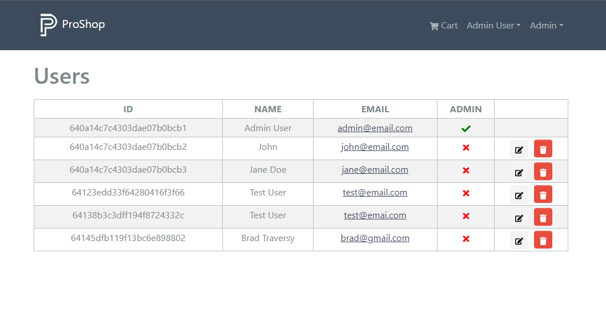

# List Users (Admin)

We now have all of the user backend routes and controller functions. Now, we want to be able to list all the users in the frontend for admins.

Open the `frontend/src/slices/usersApiSlice.js` file and add the following query:

```js
 getUsers: builder.query({
  query: () => ({
    url: USERS_URL,
  }),
  providesTags: ['User'],
  keepUnusedDataFor: 5,
}),
```

Export it along with the rest of the functions:

```js
export const {
  useLoginMutation,
  useLogoutMutation,
  useRegisterMutation,
  useProfileMutation,
  useGetUsersQuery,
} = usersApiSlice;
```

## User List Screen

Now we need a new screen to list users. Create a file called `UserListScreen.js` in the `frontend/src/screens/admin` folder. Add the following code:

```js
import { LinkContainer } from 'react-router-bootstrap';
import { Table, Button } from 'react-bootstrap';
import { FaTrash, FaEdit, FaCheck, FaTimes } from 'react-icons/fa';
import Message from '../../components/Message';
import Loader from '../../components/Loader';
import { useGetUsersQuery } from '../../slices/usersApiSlice';

const UserListScreen = () => {
  const { data: users, refetch, isLoading, error } = useGetUsersQuery();

  const deleteHandler = async (id) => {
    console.log('delete');
  };

  return (
    <>
      <h1>Users</h1>
      {isLoading ? (
        <Loader />
      ) : error ? (
        <Message variant='danger'>
          {error?.data?.message || error.error}
        </Message>
      ) : (
        <Table striped bordered hover responsive className='table-sm'>
          <thead>
            <tr>
              <th>ID</th>
              <th>NAME</th>
              <th>EMAIL</th>
              <th>ADMIN</th>
              <th></th>
            </tr>
          </thead>
          <tbody>
            {users.map((user) => (
              <tr key={user._id}>
                <td>{user._id}</td>
                <td>{user.name}</td>
                <td>
                  <a href={`mailto:${user.email}`}>{user.email}</a>
                </td>
                <td>
                  {user.isAdmin ? (
                    <FaCheck style={{ color: 'green' }} />
                  ) : (
                    <FaTimes style={{ color: 'red' }} />
                  )}
                </td>
                <td>
                  <LinkContainer to={`/admin/user/${user._id}/edit`}>
                    <Button variant='light' className='btn-sm'>
                      <FaEdit />
                    </Button>
                  </LinkContainer>
                  <Button
                    variant='danger'
                    className='btn-sm'
                    onClick={() => deleteHandler(user._id)}
                  >
                    <FaTrash style={{ color: 'white' }} />
                  </Button>
                </td>
              </tr>
            ))}
          </tbody>
        </Table>
      )}
    </>
  );
};

export default UserListScreen;
```

We are getting all of the users and displaying them in a table. If the user is an admin, there will be a check, if not, there will be an X. We also have edit and delete buttons that are not functional yet. We just have a dummy delete handler for now.

## Admin User List Route

In the `frontend/src/index.js` file, import the screen and add the following route:

```js
import UserListScreen from './screens/admin/UserListScreen';
```

```js
{
  /* Admin users */
}
<Route path='' element={<AdminRoute />}>
  {/* Other routes */}
  <Route path='/admin/userlist' element={<UserListScreen />} />
</Route>;
```

## Admin Menu Item

We need a way to get to the page. In the `frontend/src/components/Header.js` file, add the option to the admin links:

```js
{
  userInfo && userInfo.isAdmin && (
    <NavDropdown title='Admin' id='adminmenu'>
      <LinkContainer to='/admin/productlist'>
        <NavDropdown.Item>Products</NavDropdown.Item>
      </LinkContainer>
      <LinkContainer to='/admin/orderlist'>
        <NavDropdown.Item>Orders</NavDropdown.Item>
      </LinkContainer>
      <LinkContainer to='/admin/userlist'>
        <NavDropdown.Item>Users</NavDropdown.Item>
      </LinkContainer>
    </NavDropdown>
  );
}
```

Now you should be able to see the users in the admin panel.


