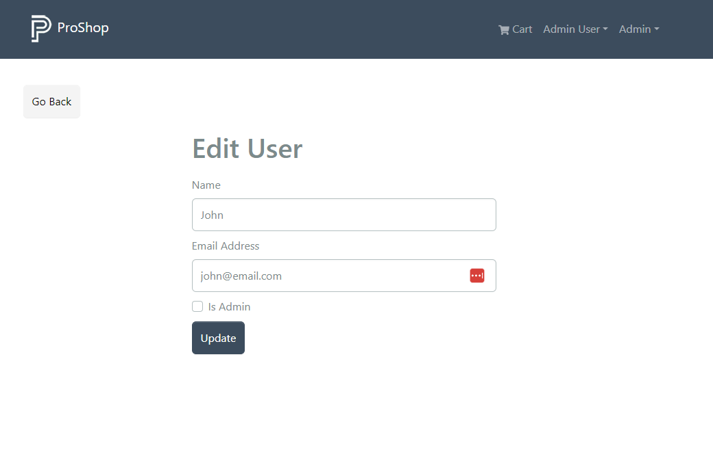

# Update Users

We can view and delete users. We also want to be able to update them. We have the backend route all set, so let's go into the `frontend/src/slice/usersApiSlice.js` file and add the query to get a user's details and a mutation to update the user.

```js
updateUser: builder.mutation({
  query: (data) => ({
    url: `${USERS_URL}/${data.userId}`,
    method: 'PUT',
    body: data,
  }),
  invalidatesTags: ['User'],
}),
getUserDetails: builder.query({
  query: (id) => ({
    url: `${USERS_URL}/${id}`,
  }),
  keepUnusedDataFor: 5,
}),
```

Export them along with the other functions:

```js
export const {
  useLoginMutation,
  useLogoutMutation,
  useRegisterMutation,
  useProfileMutation,
  useGetUsersQuery,
  useDeleteUserMutation,
  useUpdateUserMutation,
  useGetUserDetailsQuery,
} = usersApiSlice;
```

## User Edit Screen

Create the `frontend/src/screens/admin/UserEditScreen.js` file and add the following code:

```js
import { useEffect, useState } from 'react';
import { Link, useNavigate, useParams } from 'react-router-dom';
import { Form, Button } from 'react-bootstrap';
import Message from '../../components/Message';
import Loader from '../../components/Loader';
import FormContainer from '../../components/FormContainer';
import { toast } from 'react-toastify';
import {
  useGetUserDetailsQuery,
  useUpdateUserMutation,
} from '../../slices/usersApiSlice';

const UserEditScreen = () => {
  const { id: userId } = useParams();
  const [name, setName] = useState('');
  const [email, setEmail] = useState('');
  const [isAdmin, setIsAdmin] = useState(false);

  const {
    data: user,
    isLoading,
    error,
    refetch,
  } = useGetUserDetailsQuery(userId);

  const navigate = useNavigate();

  const submitHandler = async (e) => {
    e.preventDefault();
    console.log('submit');
  };

  useEffect(() => {
    if (user) {
      setName(user.name);
      setEmail(user.email);
      setIsAdmin(user.isAdmin);
    }
  }, [user]);

  return (
    <>
      <Link to='/admin/userlist' className='btn btn-light my-3'>
        Go Back
      </Link>
      <FormContainer>
        <h1>Edit User</h1>
        {isLoading ? (
          <Loader />
        ) : error ? (
          <Message variant='danger'>
            {error?.data?.message || error.error}
          </Message>
        ) : (
          <Form onSubmit={submitHandler}>
            <Form.Group className='my-2' controlId='name'>
              <Form.Label>Name</Form.Label>
              <Form.Control
                type='name'
                placeholder='Enter name'
                value={name}
                onChange={(e) => setName(e.target.value)}
              ></Form.Control>
            </Form.Group>

            <Form.Group className='my-2' controlId='email'>
              <Form.Label>Email Address</Form.Label>
              <Form.Control
                type='email'
                placeholder='Enter email'
                value={email}
                onChange={(e) => setEmail(e.target.value)}
              ></Form.Control>
            </Form.Group>

            <Form.Group className='my-2' controlId='isadmin'>
              <Form.Check
                type='checkbox'
                label='Is Admin'
                checked={isAdmin}
                onChange={(e) => setIsAdmin(e.target.checked)}
              ></Form.Check>
            </Form.Group>

            <Button type='submit' variant='primary'>
              Update
            </Button>
          </Form>
        )}
      </FormContainer>
    </>
  );
};

export default UserEditScreen;
```

We are getting the user details from the backend via our mutation and displaying them in the form.

## Add Route

We need to add the route to `frontend/src/index.js`:

```js
import UserEditScreen from './screens/admin/UserEditScreen';
```

```js
{
  /* Admin users */
}
<Route path='' element={<AdminRoute />}>
  {/* Other routes... */}
  <Route path='/admin/user/:id/edit' element={<UserEditScreen />} />
</Route>;
```

Now click on a user and you should see a form with the user's info:



## Update User

We already have the mutation to update and we imported it. Let's initialize it:

```js
const [updateUser, { isLoading: loadingUpdate }] = useUpdateUserMutation();
```

And add the mutation to the `submitHandler` function:

```js
const submitHandler = async (e) => {
  e.preventDefault();
  try {
    await updateUser({ userId, name, email, isAdmin });
    toast.success('user updated successfully');
    refetch();
    navigate('/admin/userlist');
  } catch (err) {
    toast.error(err?.data?.message || err.error);
  }
};
```

Try changing the name of the user. You should see a success message and the user's name should be updated.
