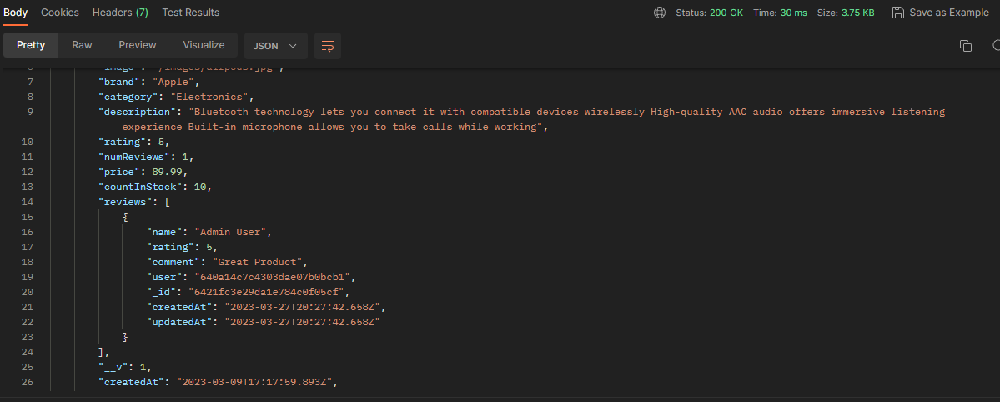

# Create Reviews - Backend

We have finished the main functionality of this project. Users can register, buy products. The admins can create products and manage orders. There are a few more extra things that I want to add such as the ability to search for products, leave reviews. We also have a product carousel to create. Let's start with the reviews.

## Backend Route

We need an endpoint in our backend to hit to be able to add a new review. This is going to go in our product controller. So open up the `backend/controllers/productController.js` file and add the following code:

```js
// @desc    Create new review
// @route   POST /api/products/:id/reviews
// @access  Private
const createProductReview = asyncHandler(async (req, res) => {
  const { rating, comment } = req.body;

  const product = await Product.findById(req.params.id);

  if (product) {
    const alreadyReviewed = product.reviews.find(
      (r) => r.user.toString() === req.user._id.toString()
    );

    if (alreadyReviewed) {
      res.status(400);
      throw new Error('Product already reviewed');
    }

    const review = {
      name: req.user.name,
      rating: Number(rating),
      comment,
      user: req.user._id,
    };

    product.reviews.push(review);

    product.numReviews = product.reviews.length;

    product.rating =
      product.reviews.reduce((acc, item) => item.rating + acc, 0) /
      product.reviews.length;

    await product.save();
    res.status(201).json({ message: 'Review added' });
  } else {
    res.status(404);
    throw new Error('Product not found');
  }
});
```

Export it:

```js
export {
  getProducts,
  getProductById,
  createProduct,
  updateProduct,
  deleteProduct,
  createProductReview,
};
```

So we have a bit going on here, but it's pretty simple to understand. We are going to find the product by the id that is passed in the url. Then we are going to check if the product exists. If it does, we are going to check if the user has already reviewed the product. If they have, we are going to throw an error. If they haven't, we are going to create a new review object. We are going to push that review object into the product's reviews array. We are going to update the number of reviews and the rating of the product. Then we are going to save the product and send a response back to the frontend.

## Add Backend Route

Now that we have the controller function, we need to add the route. Go into the `backend/routes/productRoutes.js` file and add the following code:

```js
import {
  getProducts,
  getProductById,
  createProduct,
  updateProduct,
  deleteProduct,
  createProductReview, // Add this line
} from '../controllers/productController.js';

router.route('/:id/reviews').post(protect, createProductReview);
```

You can test this route using Postman. Create a POST request to `http://localhost:5000/api/products/SOME_PRODUCT_ID/reviews`. Make sure you are logged in with the cookie.

You should see the message 'Review added'. Now if you find the products, you should see the review in the JSON response.


