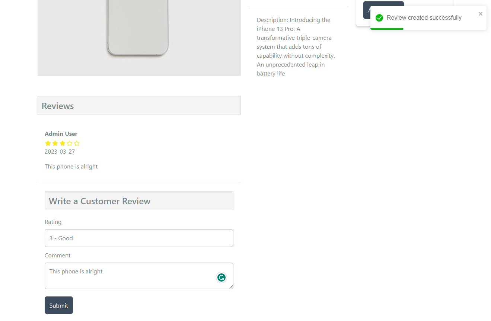

# Create Reviews - Frontend

We have the backend working as far as adding reviews, now let's handle the frontend.

Open the `frontend/src/slices/productsApiSlice.js` file and add the following mutation:

```js
createReview: builder.mutation({
  query: (data) => ({
    url: `${PRODUCTS_URL}/${data.productId}/reviews`,
    method: 'POST',
    body: data,
  }),
  invalidatesTags: ['Product'],
}),
```

Export it:

```js
export const {
  useGetProductsQuery,
  useGetProductDetailsQuery,
  useCreateProductMutation,
  useUpdateProductMutation,
  useUploadProductImageMutation,
  useDeleteProductMutation,
  useCreateReviewMutation,
} = productsApiSlice;
```

## Product Screen

Now open the `frontend/src/screens/ProductScreen.js` file and import the mutation along with the details query. We also need `toast` and `useSelector` to get the user from the state:

```js
import {
  useGetProductDetailsQuery,
  useCreateReviewMutation,
} from '../slices/productsApiSlice';
import { toast } from 'react-toastify';
import { useDispatch, useSelector } from 'react-redux';
```

Initialize it right above the return:

```js
const [createReview, { isLoading: loadingProductReview }] =
  useCreateReviewMutation();
```

Add the following state under the `qty` state:

```js
const [rating, setRating] = useState(0);
const [comment, setComment] = useState('');
```

Now get the user:

```js
const { userInfo } = useSelector((state) => state.auth);
```

After we submit, we need to refetch the product details. We can do this by using the `refetch` function from the `useGetProductDetailsQuery` hook:

```js
const {
  data: product,
  isLoading,
  refetch, // <--- add this
  error,
} = useGetProductDetailsQuery(productId);
```

Now we are going to add a new `<Row>` under the `</Row>` at the end of the JSX output. This will list the reviews and show the form for adding a review:

```js
<Row>
  <Col md={6}>
    <h2>Reviews</h2>
    {product.reviews.length === 0 && <Message>No Reviews</Message>}
    <ListGroup variant='flush'>
      {product.reviews.map((review) => (
        <ListGroup.Item key={review._id}>
          <strong>{review.name}</strong>
          <Rating value={review.rating} />
          <p>{review.createdAt.substring(0, 10)}</p>
          <p>{review.comment}</p>
        </ListGroup.Item>
      ))}
      <ListGroup.Item>
        <h2>Write a Customer Review</h2>

        {loadingProductReview && <Loader />}

        {userInfo ? (
          <Form onSubmit={submitHandler}>
            <Form.Group className='my-2' controlId='rating'>
              <Form.Label>Rating</Form.Label>
              <Form.Control
                as='select'
                required
                value={rating}
                onChange={(e) => setRating(e.target.value)}
              >
                <option value=''>Select...</option>
                <option value='1'>1 - Poor</option>
                <option value='2'>2 - Fair</option>
                <option value='3'>3 - Good</option>
                <option value='4'>4 - Very Good</option>
                <option value='5'>5 - Excellent</option>
              </Form.Control>
            </Form.Group>
            <Form.Group className='my-2' controlId='comment'>
              <Form.Label>Comment</Form.Label>
              <Form.Control
                as='textarea'
                row='3'
                required
                value={comment}
                onChange={(e) => setComment(e.target.value)}
              ></Form.Control>
            </Form.Group>
            <Button
              disabled={loadingProductReview}
              type='submit'
              variant='primary'
            >
              Submit
            </Button>
          </Form>
        ) : (
          <Message>
            Please <Link to='/login'>sign in</Link> to write a review
          </Message>
        )}
      </ListGroup.Item>
    </ListGroup>
  </Col>
</Row>
```

Finally, add the `submitHandler` function:

```js
const submitHandler = async (e) => {
  e.preventDefault();

  try {
    await createReview({
      productId,
      rating,
      comment,
    }).unwrap();
    refetch();
    toast.success('Review created successfully');
  } catch (err) {
    toast.error(err?.data?.message || err.error);
  }
};
```

Now you should see the reviews and be able to create one with the form as long as you are logged in:



If you try again, it will show an error saying that you already reviewed this product.
