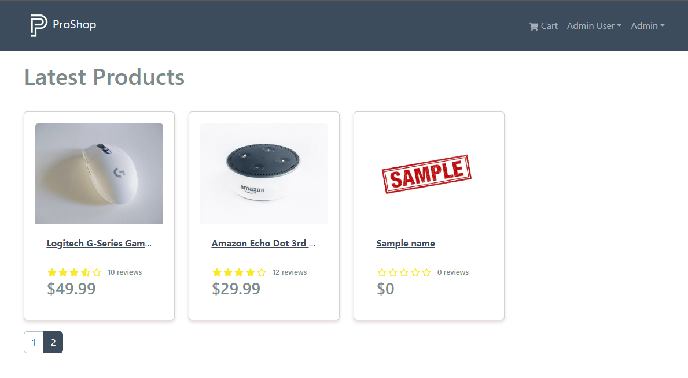
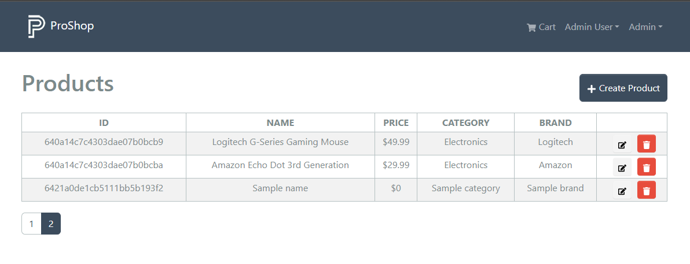

# Paginate Component

We now have paginate functionality on our products, but we have no UI for it. Let's add a component to display the pagination links.

Create a new file in the `frontend/components` folder called `Paginate.jsx`.

```jsx
import { Pagination } from 'react-bootstrap';
import { LinkContainer } from 'react-router-bootstrap';

const Paginate = ({ pages, page, isAdmin = false }) => {
  return (
    pages > 1 && (
      <Pagination>
        {[...Array(pages).keys()].map((x) => (
          <LinkContainer
            key={x + 1}
            to={!isAdmin ? `/page/${x + 1}` : `/admin/productlist/${x + 1}`}
          >
            <Pagination.Item active={x + 1 === page}>{x + 1}</Pagination.Item>
          </LinkContainer>
        ))}
      </Pagination>
    )
  );
};

export default Paginate;
```

We are using the `react-bootstrap` `Pagination` component. We are also using the `LinkContainer` component from `react-router-bootstrap` to create links.

We are using the `pages` and `page` props to determine how many pages we need to display and which page is active.

We are also using the `isAdmin` prop to determine if we are in the admin area or not. If we are in the admin area, we need to use a different route.

Now, let's add the `Paginate` component to the `HomeScreen` component.

```jsx
import Paginate from '../components/Paginate';
```

Add the component right under the ending `</Row>`

```jsx
<Paginate pages={data.pages} page={data.page} />
```

You should now have working pagination in the frontend UI



## Admin Products

Now we need to bring it in and use it in the admin area.

Open the `frontend/screens/admin/ProductListScreen.js` file and add the `Paginate` component.

```jsx
import Paginate from '../../components/Paginate';
```

Add the component right under the ending `</Table>`

```jsx
<Paginate pages={data.pages} page={data.page} isAdmin={true} />
```

Now you should see the pagination in the admin products.



If you want to change the number of products, simply change it in the `getProducts` function in the product controller on the backend. If you set it to 12, for instance, you won't see any pagination links because we don't have more than 12 products.
