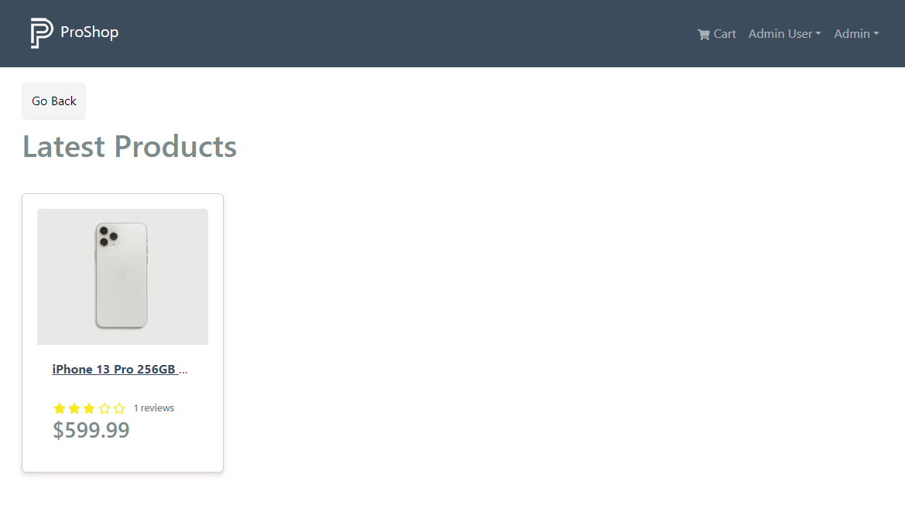

# Search Products

We want users to be able to search for products. So we need to do a few things. We need the backend to take in a query string and search for products that match the query string. We also need to add a search box to the frontend so that users can enter a query string. Let's start with the backend.

## Backend

Open your `productController.js` file and add this code to the `getProducts` function:

```js
const getProducts = asyncHandler(async (req, res) => {
  const pageSize = 12;
  const page = Number(req.query.pageNumber) || 1;

  const keyword = req.query.keyword
    ? {
        name: {
          $regex: req.query.keyword,
          $options: 'i',
        },
      }
    : {};

  const count = await Product.countDocuments({ ...keyword });
  const products = await Product.find({ ...keyword })
    .limit(pageSize)
    .skip(pageSize * (page - 1));

  res.json({ products, page, pages: Math.ceil(count / pageSize) });
});
```

This code is using regular expressions (regex) to search for products based on a keyword entered by the user. The `req.query.keyword` parameter is used to search for products with names that contain the given keyword.

The `$regex` operator is used to specify the regular expression pattern to match, and the $options parameter is used to set the matching options. In this case, the `i` option is used to make the search case-insensitive.

The `...keyword` syntax is used to spread the keyword object into the `find()` and `countDocuments()` functions. If the user does not enter a keyword, then the keyword object will be an empty object, and the `find()` and `countDocuments()` functions will return all the products.

## Frontend

Now, let's go into the `frontend/slices/productsApiSlice.js` file and add this code to the `getProducts` query:

```js
getProducts: builder.query({
  query: ({ keyword, pageNumber }) => ({
    url: PRODUCTS_URL,
    params: { keyword, pageNumber },
  }),
  keepUnusedDataFor: 5,
}),
```

We are just adding the `keyword` as a param along with the `pageNumber`.

## Pagination and Search

We also need to incorporate the search functionality into the pagination. If we don't, then the pagination will break when we search for a product.

Let's open up the `Paginate.js` component and add this code:

```jsx
import { Pagination } from 'react-bootstrap';
import { LinkContainer } from 'react-router-bootstrap';

const Paginate = ({ pages, page, isAdmin = false, keyword = '' }) => {
  return (
    pages > 1 && (
      <Pagination>
        {[...Array(pages).keys()].map((x) => (
          <LinkContainer
            key={x + 1}
            to={
              !isAdmin
                ? keyword
                  ? `/search/${keyword}/page/${x + 1}`
                  : `/page/${x + 1}`
                : `/admin/productlist/${x + 1}`
            }
          >
            <Pagination.Item active={x + 1 === page}>{x + 1}</Pagination.Item>
          </LinkContainer>
        ))}
      </Pagination>
    )
  );
};

export default Paginate;
```

We are adding the `keyword` as a prop to the `Paginate` component. We are also adding the `keyword` to the `LinkContainer` component.

## Search Routes

We need to create a route for the search functionality. Open up the `frontend/src/index.js` file and add the following:

```jsx
 <Route path="/search/:keyword" element={<HomeScreen />} />

  <Route path="/search/:keyword/page/:pageNumber" element={<HomeScreen />} />
```

The first route is for when the user enters a keyword and clicks the search button. The second route is for when the user enters a keyword and clicks on a page number.

## Home Screen

Open up the `frontend/src/screens/HomeScreen.js` file and add this code:

```jsx
const { pageNumber, keyword } = useParams();

const { data, isLoading, error } = useGetProductsQuery({
  keyword,
  pageNumber,
});
```

We are getting the `keyword` and `pageNumber` from the URL.

We are going to show a back button if we are in search mode. We will also show a product carouselm which we will add soon if we are not in search. Lets add a placeholder for now.

Add this to the top of the JSX output:

```jsx
{
  !keyword ? (
    {
      /* CAROUSEL PLACEHOLDER */
    }
  ) : (
    <Link to='/' className='btn btn-light mb-2'>
      Go Back
    </Link>
  );
}
```

Also, import the `Link` component from `react-router-dom`:

```jsx
import { Link } from 'react-router-dom';
```

Now add the keyword prop to the `Paginate` component:

```jsx
<Paginate
  pages={data.pages}
  page={data.page}
  keyword={keyword ? keyword : ''}
/>
```

Test it by typing in the URL bar `http://localhost:3000/search/phone` and you should see the search results.



Now, we just need to create the search box.
