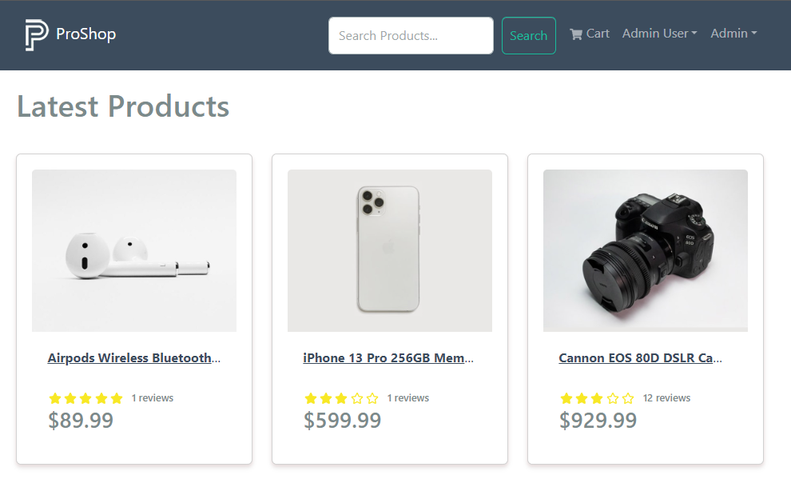

# Search Box Component

We just need a way for users to make a query, so let's create a new component at `frontend/src/components/SearchBox.js`:

Add the following code:

```jsx
import React, { useState } from 'react';
import { Form, Button } from 'react-bootstrap';
import { useParams } from 'react-router-dom';
import { useNavigate } from 'react-router-dom';

const SearchBox = () => {
  const navigate = useNavigate();
  const { keyword: urlKeyword } = useParams();
  const [keyword, setKeyword] = useState(urlKeyword);

  const submitHandler = (e) => {
    e.preventDefault();
    if (keyword) {
      navigate(`/search/${keyword.trim()}`);
    } else {
      navigate('/');
    }
  };

  return (
    <Form onSubmit={submitHandler} className='d-flex'>
      <Form.Control
        type='text'
        name='q'
        onChange={(e) => setKeyword(e.target.value)}
        value={keyword}
        placeholder='Search Products...'
        className='mr-sm-2 ml-sm-5'
      ></Form.Control>
      <Button type='submit' variant='outline-success' className='p-2 mx-2'>
        Search
      </Button>
    </Form>
  );
};

export default SearchBox;
```

We are using the `useNavigate` hook to navigate to the search route. We are also getting the `keyword` from the URL and setting it as the initial value of the `keyword` state.

Bring the `SearchBox` component into the `Header` component:

```jsx
import SearchBox from './SearchBox';
```

Add it right under the `<Nav className='ms-auto'>`:

```jsx
// ...
 <Nav className='ms-auto'>
  <SearchBox /> {/* Add this line *}
// ...
```

It should show in the header:



Try typing in the search box and clicking the search button. You should see the search results.
