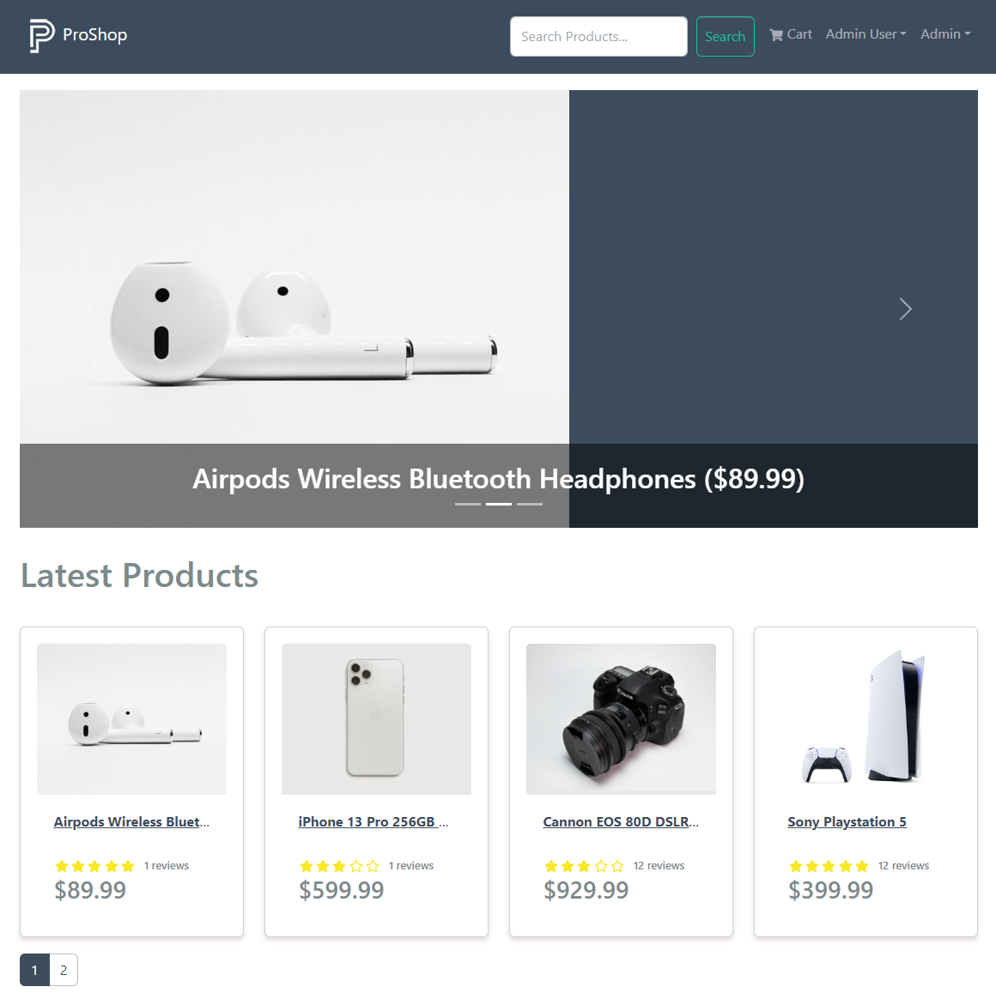

# Product Carousel

We are just about there. I would like to have a carousel that displays the top products. We are going to need a new endpoint in the backend for this.

## Backend

Open up the `backend/controllers/productController.js` file and add the following function:

```js
// @desc    Get top rated products
// @route   GET /api/products/top
// @access  Public
const getTopProducts = asyncHandler(async (req, res) => {
  const products = await Product.find({}).sort({ rating: -1 }).limit(3);

  res.json(products);
});
```

This is very simple, it just gets the top 3 products based on the rating.

Export it with the rest of the functions:

```js
export {
  getProducts,
  getProductById,
  createProduct,
  updateProduct,
  deleteProduct,
  createProductReview,
  getTopProducts,
};
```

Open up the `backend/routes/productRoutes.js` file. Import the new functon add the following route:

```js
productRoutes.get('/top', getTopProducts);
```

## Frontend

Open the `frontend/slices/productsApiSlice.js` file and add the following function:

```js
getTopProducts: builder.query({
  query: () => `${PRODUCTS_URL}/top`,
  keepUnusedDataFor: 5,
}),
```

Export it:

```js
export const {
  useGetProductsQuery,
  useGetProductDetailsQuery,
  useCreateProductMutation,
  useUpdateProductMutation,
  useUploadProductImageMutation,
  useDeleteProductMutation,
  useCreateReviewMutation,
  useGetTopProductsQuery,
} = productsApiSlice;
```

We are going to create a new component for the carousel. Create a new file at `frontend/src/components/ProductCarousel.js` and add the following code:

```jsx
import { Link } from 'react-router-dom';
import { Carousel, Image } from 'react-bootstrap';
import Loader from './Loader';
import Message from './Message';
import { useGetTopProductsQuery } from '../slices/productsApiSlice';

const ProductCarousel = () => {
  const { data: products, isLoading, error } = useGetTopProductsQuery();

  return isLoading ? (
    <Loader />
  ) : error ? (
    <Message variant='danger'>{error?.data?.message || error.error}</Message>
  ) : (
    <Carousel pause='hover' className='bg-primary mb-4'>
      {products.map((product) => (
        <Carousel.Item key={product._id}>
          <Link to={`/product/${product._id}`}>
            <Image src={product.image} alt={product.name} fluid />
            <Carousel.Caption className='carousel-caption'>
              <h2 className='text-white text-right'>
                {product.name} (${product.price})
              </h2>
            </Carousel.Caption>
          </Link>
        </Carousel.Item>
      ))}
    </Carousel>
  );
};

export default ProductCarousel;
```

We are fetching the top products using the `useGetTopProductsQuery` hook. We are also usingthe Carousel from `react-bootstrap` and the `Link` component from `react-router-dom` to link to the product details page.

We are going to add a little bit of custom CSS. Open the `frontend/src/assets/styles/index.css` file and add the following:

```css
.carousel-caption {
  position: absolute;
  width: 100%;
  left: 0;
  right: 0;
  bottom: 0;
  background: rgba(0, 0, 0, 0.5);
}
```

Open the `frontend/src/screens/HomeScreen.js` file and import the new component:

```jsx
import ProductCarousel from '../components/ProductCarousel';
```

Replace the placeholder with the component:

```jsx
{
  !keyword ? (
    <ProductCarousel />
  ) : (
    <Link to='/' className='btn btn-light'>
      Go Back
    </Link>
  );
}
```

Now, you should see the product carousel with the highest rated products.


